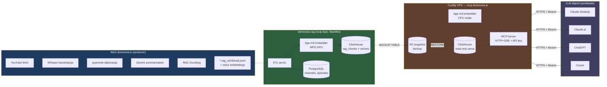
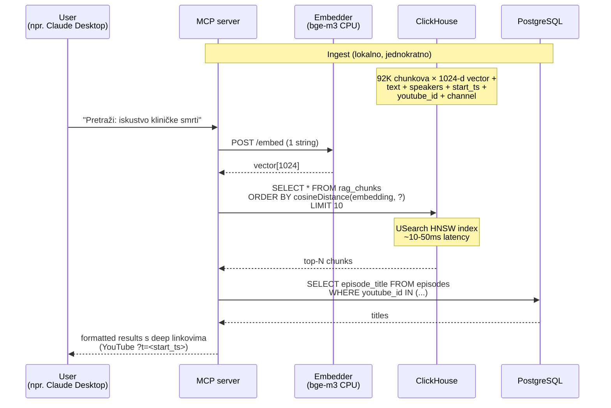
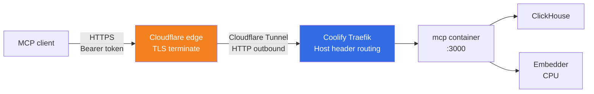

# domovina-rag

> **Status:** ✅ Faza 1 dovršena, cloud MCP endpoint live na [`https://mcp.domovina.ai`](https://mcp.domovina.ai/health). Ingest + R2 sync u tijeku.

RAG (Retrieval-Augmented Generation) backend za hrvatski katolički / politički podcast korpus.

Self-hosted, open-source stack koji:

- Konzumira pripremljene chunkove iz [`fetch.domovina.tv`](https://github.com/domovinatv/fetch.domovina.tv) (data producer)
- Sprema ih u **ClickHouse** (vector store + analytics) + **PostgreSQL** (transakcijska istina)
- Eksponira semantic search preko **MCP** (Model Context Protocol) servera
- Spaja se s bilo kojim MCP klijentom: Claude Desktop, Claude.ai, ChatGPT, Cursor, custom agent

## Arhitektura



**Strict separation of concerns:**

- **Producer** ([`fetch.domovina.tv`](https://github.com/domovinatv/fetch.domovina.tv)): YouTube fetch, ASR, dijarizacija, summarization, chunking, voice embeddings
- **Consumer** (ovaj repo): import u DB, query-time embed, retrieval, MCP API, entity resolution

Producer outputi (`*.rag_combined.jsonl` + voice embedding JSON-ovi) su formalni data contract — vidi [`fetch.domovina.tv/docs/data_contract.md`](https://github.com/domovinatv/fetch.domovina.tv/blob/main/docs/data_contract.md).

## Dataflow



## Komponente

| # | Servis | Tehnologija | Status | Što radi |
|---|---|---|---|---|
| 1 | **PostgreSQL** | pgvector/pgvector:pg16 | ✅ | `channels`, `episodes`, `sync_state`, `speakers` (placeholder) |
| 2 | **ClickHouse** | clickhouse-server:24.10 | ✅ | `rag_chunks` (ReplacingMergeTree, vector_similarity HNSW), 1024-d cosine |
| 3 | **Embedder** | Python 3.11+, FastAPI, bge-m3 | ✅ | `/embed` 1024-d L2-norm; MPS dev / CPU prod |
| 4 | **ETL** | Python 3.11+, click CLI | ✅ | JSONL → embed → CH; idempotent via `sync_state` |
| 5 | **MCP server** | Node 22+, TypeScript, MCP SDK | ✅ | tool `search_podcasts(query, channel?, limit?, lexical_terms?)`; HTTP+SSE i stdio |
| 6 | **Reranker** | Python + bge-reranker-v2-m3 | ⏳ Faza 2 | rerank top-N nakon CH search-a |
| 7 | **Eval rig** | TBD | ⏳ Faza 2 | recall@k, precision@k na golden setu |
| 8 | **Speaker entity resolution** | TitaNet + pyannote ensemble | ⏳ Faza 3 | `SPEAKER_XX` → kanonska imena |

## Quick start (lokalni dev)

```bash
# 1. Kloniraj + popuni env
cp .env.example .env
# Edit .env: postavi POSTGRES_PASSWORD, CLICKHOUSE_PASSWORD, MCP_API_KEY,
# DATA_SOURCE_DIR (path do fetch.domovina.tv outputa)

# 2. Podigni stack
docker compose up -d
# pg + ch + embedder (CPU mode) + mcp na portu 3000

# 3. Health check
curl http://localhost:3000/health
# {"status":"ok"}

# 4. ETL ingest (kad imaš JSONL podataka)
docker compose --profile etl run --rm etl ingest --input /data --batch-size 4
```

**Apple Silicon (M1/M2/M3) — MPS GPU dev workflow** za ~40× brži ingest:

```bash
# Terminal 1: PG + CH (kontejneri)
docker compose up -d postgres clickhouse

# Terminal 2: host embedder na MPS GPU
cd services/embedder
EMBEDDER_DEVICE=mps EMBEDDER_MAX_TEXT_LEN=32768 \
  .venv/bin/uvicorn app.main:app --host 0.0.0.0 --port 8000

# Terminal 3: ETL koji zove host embedder
# (.env mora imati EMBEDDER_URL=http://host.docker.internal:8000)
docker compose --profile etl run --rm etl ingest --input /data --batch-size 4
```

Detalji u [`docs/cloud_deployment_plan.md`](./docs/cloud_deployment_plan.md) i memory `[[project-mps-embedder-host]]`.

## Cloud endpoint (production)



**Endpoint**: `https://mcp.domovina.ai`
- `GET /health` — public health check
- `POST /mcp` — Streamable HTTP MCP transport (zahtijeva `Authorization: Bearer <key>`). Initialize handshake vraća `Mcp-Session-Id` header za sljedeće request-ove.
- `GET /mcp` — opcionalni SSE stream za server-sent notifications
- `DELETE /mcp` — terminacija sesije

Streamable HTTP transport je native-podržan u Claude.ai Custom Connectors i Claude Desktop (no bridge needed).

Deploy preko [Coolify](https://app.domovina.link/) iz ovog repo-a; sync iz lokalne baze planiran preko R2 BACKUP/RESTORE (vidi [`docs/cloud_deployment_plan.md`](./docs/cloud_deployment_plan.md)).

## Struktura repo-a

```
domovina-rag/
├── docker-compose.yml            # Master stack definition (repo root)
├── .env.example                  # Required env vars template
├── infra/
│   ├── postgres/init.sql         # PG schema (channels, episodes, sync_state)
│   └── clickhouse/init.sql       # CH schema (rag_chunks, HNSW index)
├── services/
│   ├── embedder/                 # Python FastAPI bge-m3 wrapper
│   ├── etl/                      # Python ETL: JSONL → CH
│   ├── mcp/                      # TypeScript MCP server
│   └── reranker/                 # (Faza 2 stub)
├── docs/
│   ├── README.md                 # Doc index + cross-links to producer repo
│   └── cloud_deployment_plan.md  # 8-phase Coolify+R2 deployment plan
└── CLAUDE.md                     # Project-specific Claude Code guidance
```

## Hard-defined odluke (NE mijenjati bez ADR-a)

| Odluka | Vrijednost | Razlog |
|---|---|---|
| Licenca | AGPL-3.0 | Force-share modifications za hosted service |
| Primarni DB roles | PG = OLTP, CH = OLAP + vectors | Separation of concerns, vidi plan §2 |
| Embedding model | bge-m3 (default) | MIT/Apache, multilingual, HR-friendly |
| Embedding dim | 1024 | bge-m3 standard |
| Reranker model | bge-reranker-v2-m3 | Pair s embedder, isti FlagEmbedding family |
| MCP transport (prod) | HTTP + SSE | MCP spec standard |
| MCP transport (dev) | stdio | Claude Desktop subprocess |
| MCP auth (Faza 1) | API key Bearer | Brz path to private MCP |
| MCP auth (Faza 4) | OAuth 2.1 + DCR | Public MCP, ako bude trebalo |
| Cloud orchestracija | Coolify | Self-hosted PaaS, već imamo instancu |
| Cloud network | Cloudflare Tunnel | Zero exposed ports, TLS na CF edge |

## Reference

- **Arhitekturni plan** (full detalji, schema, MCP tools, eval, speaker resolution):
  [`fetch.domovina.tv/docs/rag_clickhouse_postgres_plan.md`](https://github.com/domovinatv/fetch.domovina.tv/blob/main/docs/rag_clickhouse_postgres_plan.md)

- **Data contract** (JSONL shape, file naming, path patterns):
  [`fetch.domovina.tv/docs/data_contract.md`](https://github.com/domovinatv/fetch.domovina.tv/blob/main/docs/data_contract.md)

- **Cloud deployment plan**: [`docs/cloud_deployment_plan.md`](./docs/cloud_deployment_plan.md)

- **Per-servis docs**:
  - [`services/embedder/README.md`](./services/embedder/README.md)
  - [`services/etl/README.md`](./services/etl/README.md)
  - [`services/mcp/README.md`](./services/mcp/README.md)
  - [`services/mcp/test/e2e/README.md`](./services/mcp/test/e2e/README.md)

## Licenca

[AGPL-3.0](./LICENSE) — modifikacije hosted service-a moraju biti share-ane natrag.
