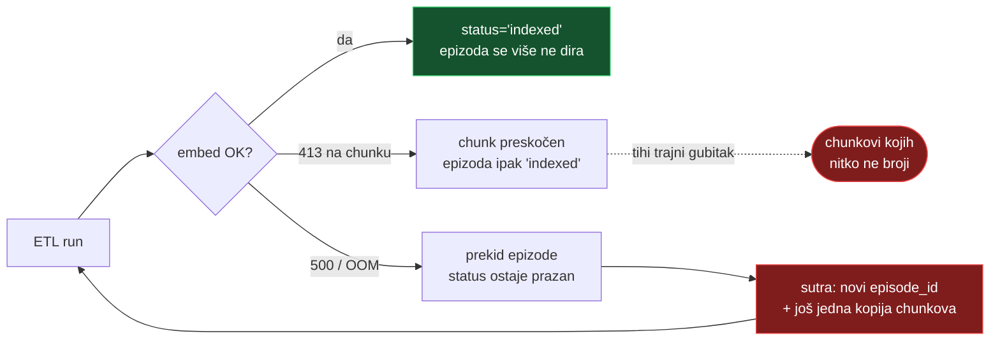

# Ingest lanac kroz tri repoa — kako je jedan limit tiho pojeo 75 epizoda

> 04.08.2026., dopunjeno 05.08. (§6–§8: delta koja popravak nije prenijela na
> cloud, duplikacija iz retry petlje, i što je od svega ostalo otvoreno).
> Nastavak na `mps-embedder-memory.md` §6, koji pokriva **embedder**.
> Ovaj dokument pokriva ono što se ne vidi ni iz jednog repoa pojedinačno:
> **uzročni lanac kroz tri repoa**, tko što posjeduje, i cijena regeneracije.
>
> Zapisano jer je dijagnoza trajala cijelu sesiju, a svaki je pojedini repo
> izgledao ispravno.

## 1. Lanac

Chunker je u produceru, limit u embedderu, a posljedica se vidi tek u statistici.
Nijedan repo nije mogao sam pokazati problem.


**Zašto nitko nije primijetio tri tjedna:** cron je gutao grešku kao
`WARN … nastavljam dalje` i završavao s `rc=0`, a `stats.json` je i dalje rastao
jer su ostale epizode ulazile. Nema alarma za „sve je prošlo, ali 2,4 % korpusa
tiho ne postoji".

## 2. Kriva mjera

`MAX_TEXT_LEN=8192` je iz srpanjskog fixa za MPS segfault (§4 onog dokumenta).
Rezao je **znakove**, a trošak je po **tokenima**:

| | vrijednost |
|---|---|
| hrvatski, znakova po tokenu | ~3,9 |
| 8192 znaka → | ~2100 tokena |
| bge-m3 podnosi | 8192 tokena |
| **efektivno smo koristili** | **~26 % kapaciteta modela** |

Od 136 odbijenih chunkova **nijedan nije prelazio model** — najdulji ima 7877
tokena. Svi su pali na mjeri koja s modelom nema veze.

## 3. Tri popravka, tri vlasnika

Granica repoa određuje tko što popravlja. Nijedan popravak sam ne bi bio dovoljan.

| # | Repo | Popravak | Bez njega |
|---|---|---|---|
| 1 | `fetch.domovina.tv` | `MAX_TOPIC_CHUNK_CHARS = 8000`, chapter se dijeli na granicama segmenata | i dalje nastaju polusatni chunkovi — loši i za pretragu |
| 2 | `domovina-rag` (embedder) | limit = memorijski budžet `244 × batch × n²`, ne znakovi | 136 chunkova ostaje odbijeno |
| 3 | `domovina-rag` (ETL) | `embed_lenient` — 413 preskače chunk, ne epizodu | jedan loš chunk i dalje ruši 23 dobra |

Popravak 2 je nosio najviše: s njim je noćni cron 04.08. unio **73 epizode i 2058
chunkova** i bez ijedne izmjene podataka.

## 4. Zamka koja se ponovila dvaput: kod commitan, tiho neprimijenjen

Dva **različita** mehanizma, isti simptom — commit prođe, ništa se ne promijeni,
nitko ne dobije grešku:

| mehanizam | zašto | koliko je trajalo |
|---|---|---|
| **launchd PATH** — `sync-stats.sh --deploy` nije nalazio `npx` | 9 skripti imalo je kopiju krive linije; node je u nvm-u, ne u Homebrewu | 3 tjedna bez deploya |
| **Docker image** — ETL se vrti u kontejneru, izvor je zapečen | nigdje nije bilo `compose build` koraka | popravak od 03.08. nije radio 04.08. |

Oba su zatvorena (`scripts/lib/cron-path.sh`, bezuvjetni build u
`sync-incremental.sh`), ali **pravilo je općenitije od oba slučaja**:

> Kad mijenjaš kod koji se izvršava izvan tvog shella — u cronu, u kontejneru, na
> drugom stroju — **dokaži da se nova verzija doista izvršava.** Commit nije
> deploy.

Provjere koje to hvataju:

```bash
# cron okruženje (env -i je bitan — bez njega naslijediš svoj PATH)
cd /tmp && env -i HOME="$HOME" USER="$USER" PATH=/usr/bin:/bin:/usr/sbin:/sbin \
  /bin/bash ~/git/domovinatv/domovina-rag/scripts/<skripta>.sh

# je li novi kod u imageu
docker run --rm --entrypoint sh domovina-rag-infra-etl:latest -c "grep -c '<simbol>' /app/etl/<fajl>.py"
```

## 5. Cijena regeneracije (izmjereno 04.08.)

Chunkanje je besplatno; plaća se samo embeddanje.

| faza | mjera |
|---|---|
| ponovno chunkanje | **4 epizode / 0,049 s** — čisto parsiranje, bez modela |
| embeddanje (MPS, novi limiti) | **3,88 chunk/s** (2058 chunkova / 8m50s) |

Stanje korpusa i opseg:

| | vrijednost |
|---|---|
| chunkova ukupno / epizoda | 149 978 / 3 157 |
| chunkova > 8000 znakova | 699 (0,47 %) |
| epizoda s bar jednim takvim | 324 |
| najdulji u korpusu | 24 071 znakova |
| **chunkova za puni re-embed** | **18 451 → ~80 min** |

Ostatak predugih chunkova je **povijesni** — ušli su dok je limit bio 32768.

**Regeneracija više nije nužna za ingest** (73 od 75 epizoda su unutra); ona je
sada poboljšanje kvalitete pretrage. Zato:

> ⚠️ Tih 324 epizoda **jesu** u ClickHouseu. `chunk_id` je pozicijski
> (`{youtube_id}_topic_003`), pa dijeljenje chaptera prenumerira sve chunkove iza
> sebe → **re-ingest bez brisanja starih redaka daje duplikate.** Za onih 75 to
> nije bio problem jer nisu imale nijedan redak.

## 6. Nastavak 04.–05.08.: delta koja popravak nije vidjela

Popravak iz §3 je ušao, ali **cloud ga nije dobio četiri dana**. Uzrok je bio u
`sync-incremental.sh`: delta se računala kao set-diff po `youtube_id`.

Taj diff vidi samo **nove** epizode. Epizoda koja je već gore, a lokalno je
re-procesirana, ima isti id na obje strane → delta 0. Cron je svaki dan uredno
javljao `"Nema delte — cloud je up-to-date"` dok je 76 epizoda gore bilo krnje
(npr. 6 od 28 chunkova). Stara verifikacija to nije mogla uhvatiti jer je
provjeravala samo **postoji li id** na cloudu.

Popravak (`7e34dd5`):

| bilo | sad |
|---|---|
| `comm -23` nad skupom `youtube_id` | diff po `(youtube_id, uniqExact(chunk_id))` |
| dump `SELECT *` | `… ORDER BY chunk_id, episode_id DESC LIMIT 1 BY chunk_id` |
| samo INSERT | promijenjene epizode se prvo BRIŠU (`mutations_sync=2`) pa ubace |
| „postoji li id" | broj chunkova po epizodi + provjera `rows == unique` |

Brisanje prije unosa nije paranoja: `chunk_id` je pozicijski (upozorenje u §5),
pa epizoda re-chunkana na **manje** chunkova ostavlja stare repove koje
ReplacingMergeTree nikad ne pokupi.

**Dokaz da radi:** u noći 05.08. je nova delta uhvatila 3 epizode
(`18212077195` 10→23, `i9hs3plDgOc` 6→15, `L7awCYyrlzI` 8→9) i gurnula 47
chunkova. Stara logika bi za sve tri rekla „delta 0".

## 7. Duplikacija: retry petlja kao generator

Pri dijagnozi §6 prva procjena rupe bila je **7806 chunkova**. Netočno — mjerene
su sirove retke. Stvarna rupa je bila **~1590**. Razlika je duplikacija, i ima
dva nezavisna izvora:

1. **ReplacingMergeTree** drži nespojene duplikate do mergea → brojka ovisi o
   trenutku (150 568 odmah nakon push-a, 149 888 nakon mergea).
2. **`episode_id` se mijenja pri svakom re-ingestu**, a u `ORDER BY` ključu je
   `(channel, upload_date, episode_id, chunk_index)` — pa dedup **ne kolabira
   ponovljene runove**.

Motor je retry petlja iz §4: epizoda koja padne nikad ne dobije
`status='indexed'` u PG-u (`is_episode_indexed`), pa je ETL svaku noć unosi
ispočetka, svaki put pod novim `episode_id`.



75 epizoda × 4 noći = **6314 redaka viška**, jedna epizoda u 24 kopije
(238 redaka za 10 stvarnih chunkova). Duplikacija je bila koncentrirana baš u
tim epizodama: izvan njih 98 redaka na 141 626.

Posljedica koja se vidjela javno: `/map` je oduvijek dedupao po chunk hashu i
crtao **143 574** točke, dok je dashboard brojao sirove retke i tvrdio
**149 888**. Ista baza, dva broja na istom sajtu. `sync-stats.sh` sad čita jedan
red po chunku (`FINAL` + `LIMIT 1 BY chunk_id`), pa se slažu.

> **Invarijanta za ubuduće:** `stats.json → totals.chunks` mora biti jednak
> `vector-map.json → points`. Ako nije, kriv je producer.

Stanje nakon čišćenja (05.08.): cloud 143 597 chunkova = 143 597 jedinstvenih,
3157 epizoda, 2990 h.

## 8. Otvoreno

- **Embed greške padaju same:** 75 (01.–03.08.) → 3 (04.08.) → **1 (05.08.)**.
  Sve su to iste stare epizode iz `launched`, ne nove. Duge nove prolaze —
  Mrežnica epizode koje su padale 01.–03.08. od 04.08. ulaze uredno.
- **Zadnja koja pada nije duga** (45 chunkova, najdulji 3532 znaka) nego pada na
  **MPS OOM** (`500`, `other allocations: 4.08 GiB` od 7,45 GB dozvoljenih) —
  dakle na pritisak memorije Maca u 04:00, ne na sadržaj. Tvrda kapica iz §6
  starog popisa time **jest** okinuta u praksi, i degradira kao `500`, što po
  dizajnu prekida epizodu. Razmisliti o spuštanju kapice (da OOM postane
  kontroliran `413`) ili retryju na `500`.
- **`episode_id` churn NIJE riješen** u `services/etl`. Duplikacija je stala samo
  zato što epizode više ne padaju. Trajni popravak: stabilan `episode_id` ili
  `chunk_id` u `ORDER BY` ključu.
- **413 po chunku je trajni tihi gubitak** — epizoda uđe nepotpuna i dobije
  `indexed`. `load.py` za to ima namjenski WARNING, ali ga je cron filtrirao van
  (`grep -E 'Pronađeno|Done:|ERROR'`); popravljeno u `a611bd2`, vidljivo od
  06.08. Unatrag se ne može rekonstruirati koliko je chunkova tako otišlo.
- **Lokalni disk 13 GB / 460 GB (98 %)** — jedino što realno može srušiti noćni
  ciklus; ETL, Docker i UMAP svi pišu tamo.
- **Regeneracija 324 epizode** i dalje čeka odluku (vidi upozorenje u §5).

## 9. Vezani dokumenti

- `mps-embedder-memory.md` §6 — mjerenja memorije, budžet, kapica
- `data-refresh-flow.md` §10 — PATH u cronu i kako se testira
- `2026-08-03-mapa-osoba-odluke-i-zamke.md` §3.7 — ista zamka iz kuta mape osoba
- `../fetch.domovina.tv/CLAUDE.md` § RAG Chunking Constants — vlasnik chunkera
