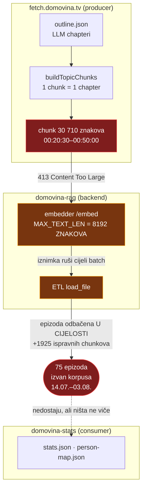

# Ingest lanac kroz tri repoa — kako je jedan limit tiho pojeo 75 epizoda

> 04.08.2026. Nastavak na `mps-embedder-memory.md` §6, koji pokriva **embedder**.
> Ovaj dokument pokriva ono što se ne vidi ni iz jednog repoa pojedinačno:
> **uzročni lanac kroz tri repoa**, tko što posjeduje, i cijena regeneracije.
>
> Zapisano jer je dijagnoza trajala cijelu sesiju, a svaki je pojedini repo
> izgledao ispravno.

## 1. Lanac

Chunker je u produceru, limit u embedderu, a posljedica se vidi tek u statistici.
Nijedan repo nije mogao sam pokazati problem.



**Zašto nitko nije primijetio tri tjedna:** cron je gutao grešku kao
`WARN … nastavljam dalje` i završavao s `rc=0`, a `stats.json` je i dalje rastao
jer su ostale epizode ulazile. Nema alarma za „sve je prošlo, ali 2,4 % korpusa
tiho ne postoji".

## 2. Kriva mjera

`MAX_TEXT_LEN=8192` je iz srpanjskog fixa za MPS segfault (§4 onog dokumenta).
Rezao je **znakove**, a trošak je po **tokenima**:

| | vrijednost |
|---|---|
| hrvatski, znakova po tokenu | ~3,9 |
| 8192 znaka → | ~2100 tokena |
| bge-m3 podnosi | 8192 tokena |
| **efektivno smo koristili** | **~26 % kapaciteta modela** |

Od 136 odbijenih chunkova **nijedan nije prelazio model** — najdulji ima 7877
tokena. Svi su pali na mjeri koja s modelom nema veze.

## 3. Tri popravka, tri vlasnika

Granica repoa određuje tko što popravlja. Nijedan popravak sam ne bi bio dovoljan.

| # | Repo | Popravak | Bez njega |
|---|---|---|---|
| 1 | `fetch.domovina.tv` | `MAX_TOPIC_CHUNK_CHARS = 8000`, chapter se dijeli na granicama segmenata | i dalje nastaju polusatni chunkovi — loši i za pretragu |
| 2 | `domovina-rag` (embedder) | limit = memorijski budžet `244 × batch × n²`, ne znakovi | 136 chunkova ostaje odbijeno |
| 3 | `domovina-rag` (ETL) | `embed_lenient` — 413 preskače chunk, ne epizodu | jedan loš chunk i dalje ruši 23 dobra |

Popravak 2 je nosio najviše: s njim je noćni cron 04.08. unio **73 epizode i 2058
chunkova** i bez ijedne izmjene podataka.

## 4. Zamka koja se ponovila dvaput: kod commitan, tiho neprimijenjen

Dva **različita** mehanizma, isti simptom — commit prođe, ništa se ne promijeni,
nitko ne dobije grešku:

| mehanizam | zašto | koliko je trajalo |
|---|---|---|
| **launchd PATH** — `sync-stats.sh --deploy` nije nalazio `npx` | 9 skripti imalo je kopiju krive linije; node je u nvm-u, ne u Homebrewu | 3 tjedna bez deploya |
| **Docker image** — ETL se vrti u kontejneru, izvor je zapečen | nigdje nije bilo `compose build` koraka | popravak od 03.08. nije radio 04.08. |

Oba su zatvorena (`scripts/lib/cron-path.sh`, bezuvjetni build u
`sync-incremental.sh`), ali **pravilo je općenitije od oba slučaja**:

> Kad mijenjaš kod koji se izvršava izvan tvog shella — u cronu, u kontejneru, na
> drugom stroju — **dokaži da se nova verzija doista izvršava.** Commit nije
> deploy.

Provjere koje to hvataju:

```bash
# cron okruženje (env -i je bitan — bez njega naslijediš svoj PATH)
cd /tmp && env -i HOME="$HOME" USER="$USER" PATH=/usr/bin:/bin:/usr/sbin:/sbin \
  /bin/bash ~/git/domovinatv/domovina-rag/scripts/<skripta>.sh

# je li novi kod u imageu
docker run --rm --entrypoint sh domovina-rag-infra-etl:latest -c "grep -c '<simbol>' /app/etl/<fajl>.py"
```

## 5. Cijena regeneracije (izmjereno 04.08.)

Chunkanje je besplatno; plaća se samo embeddanje.

| faza | mjera |
|---|---|
| ponovno chunkanje | **4 epizode / 0,049 s** — čisto parsiranje, bez modela |
| embeddanje (MPS, novi limiti) | **3,88 chunk/s** (2058 chunkova / 8m50s) |

Stanje korpusa i opseg:

| | vrijednost |
|---|---|
| chunkova ukupno / epizoda | 149 978 / 3 157 |
| chunkova > 8000 znakova | 699 (0,47 %) |
| epizoda s bar jednim takvim | 324 |
| najdulji u korpusu | 24 071 znakova |
| **chunkova za puni re-embed** | **18 451 → ~80 min** |

Ostatak predugih chunkova je **povijesni** — ušli su dok je limit bio 32768.

**Regeneracija više nije nužna za ingest** (73 od 75 epizoda su unutra); ona je
sada poboljšanje kvalitete pretrage. Zato:

> ⚠️ Tih 324 epizoda **jesu** u ClickHouseu. `chunk_id` je pozicijski
> (`{youtube_id}_topic_003`), pa dijeljenje chaptera prenumerira sve chunkove iza
> sebe → **re-ingest bez brisanja starih redaka daje duplikate.** Za onih 75 to
> nije bio problem jer nisu imale nijedan redak.

## 6. Otvoreno

- **3 epizode** još nisu unesene (`launched` ×2, `poduzetnistvo_s_povjerenjem` ×1).
  Padale su zbog starog Docker imagea; cron ih ponavlja jer nisu označene kao
  gotove. Očekivano riješeno prvim sljedećim ciklusom — **provjeri log 05.08.**
- **Tvrda MPS kapica** (8 GB, `set_per_process_memory_fraction`) potvrđena je pri
  startupu, ali još nije bila okinuta u praksi — nije dokazano da RuntimeApi put
  degradira uredno pod pravim opterećenjem.
- **Regeneracija 324 epizode** čeka odluku (vidi upozorenje o duplikatima).

## 7. Vezani dokumenti

- `mps-embedder-memory.md` §6 — mjerenja memorije, budžet, kapica
- `data-refresh-flow.md` §10 — PATH u cronu i kako se testira
- `2026-08-03-mapa-osoba-odluke-i-zamke.md` §3.7 — ista zamka iz kuta mape osoba
- `../fetch.domovina.tv/CLAUDE.md` § RAG Chunking Constants — vlasnik chunkera
