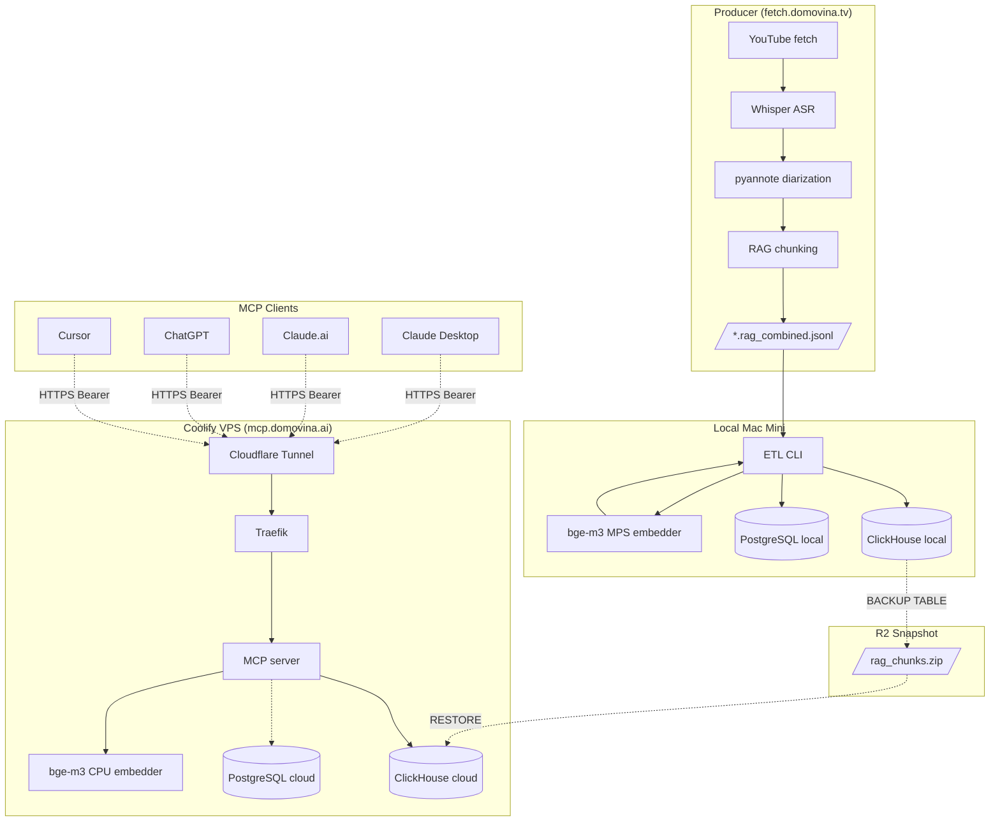

# Documentation

Index dokumenata u ovom repo-u + cross-linkovi na sibling producer repo.

## U ovom repo-u

| Doc | Sadržaj |
|---|---|
| [`cloud_deployment_plan.md`](./cloud_deployment_plan.md) | 8-fazni plan deploymenta na Coolify + Cloudflare Tunnel + R2 backup/restore. Trenutno stanje, otvorene stavke, troubleshooting. |
| [Root `README.md`](../README.md) | Što stack radi, dataflow, quick start, status komponenti |
| [`CLAUDE.md`](../CLAUDE.md) | Project-specific guidance za Claude Code agenta (lokalni dev workflow, jezične konvencije, što NE raditi) |

### Po-servisu

| Servis | README |
|---|---|
| Embedder (bge-m3 FastAPI) | [`services/embedder/README.md`](../services/embedder/README.md) |
| ETL (JSONL → ClickHouse) | [`services/etl/README.md`](../services/etl/README.md) |
| MCP server (TS + Express + MCP SDK) | [`services/mcp/README.md`](../services/mcp/README.md) |
| MCP e2e test set | [`services/mcp/test/e2e/README.md`](../services/mcp/test/e2e/README.md) |
| Reranker (Faza 2 stub) | [`services/reranker/README.md`](../services/reranker/README.md) |

## U sibling producer repo-u (`fetch.domovina.tv`)

Arhitekturni dokumenti, data contract i implementacijski detalji producer side-a žive **tamo** jer:

1. Nastali su iz produbljene diskusije o podacima koje taj repo proizvodi
2. Sav povijesni kontekst (Gemini guess slabosti, pyannote failure modes, voice aging matrica) je tamo
3. `data_contract.md` formalno definira API između repova — promjene tamo, ne ovdje

### Glavne reference

- **Arhitekturni plan** (ClickHouse + PostgreSQL + MCP + Eval rig + Speaker entity resolution):
  [`fetch.domovina.tv/docs/rag_clickhouse_postgres_plan.md`](https://github.com/domovinatv/fetch.domovina.tv/blob/main/docs/rag_clickhouse_postgres_plan.md)

- **Data contract** (shape inputa: JSONL, JSON, SRT, embeddings):
  [`fetch.domovina.tv/docs/data_contract.md`](https://github.com/domovinatv/fetch.domovina.tv/blob/main/docs/data_contract.md)

## Topologija sustava

## Budući lokalni docs (kad zatreba)

- `adr/` — Architecture Decision Records (npr. zašto bge-m3 vs e5-large, zašto CH vs Qdrant)
- `operations.md` — runbookovi za production incident response
- `mcp-tools.md` — referenca svih MCP tool-ova s primjerima upita

Za sve što se tiče **data shape-a, transkripcije, dijarizacije, speaker embedding-a, producer pipeline-a** — uvijek referenciraj sibling repo. Tamo je istina.
