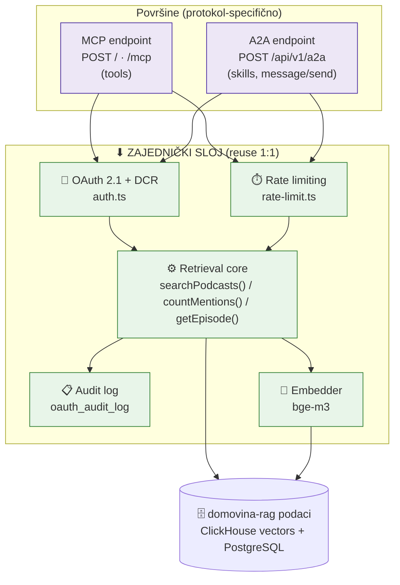
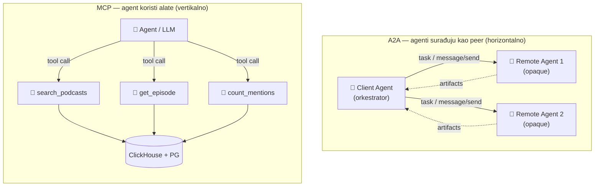
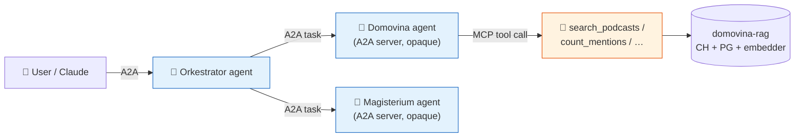
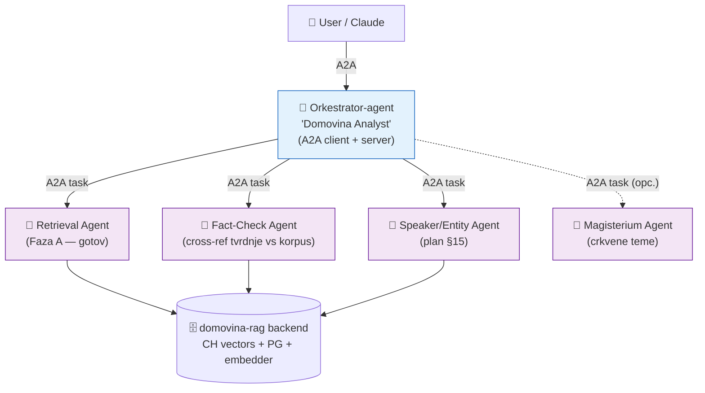

# A2A protokol + multi-agent arhitektura za domovina-rag

> Analiza i plan proširenja. Referentna točka: **Magisterium AI** (njihov MCP + A2A
> setup je gotovo identičan use-case kao naš — autoritativni korpus + cited answers).
>
> Izvori (scrape-ano firecrawl-om, sirovi markdown u `.firecrawl/`):
> - Magisterium MCP: <https://www.magisterium.com/developers/docs/mcp>
> - Magisterium A2A: <https://www.magisterium.com/developers/docs/a2a>
> - A2A protokol (Linux Foundation): <https://a2a-protocol.org/latest/>
> - A2A key concepts: <https://a2a-protocol.org/latest/topics/key-concepts/>
> - A2A agent discovery: <https://a2a-protocol.org/latest/topics/agent-discovery/>
>
> Datum analize: 2026-06-05. Naš MCP: `services/mcp/` v0.4.4.

---

## 0. TL;DR

1. **Naš MCP je već zreliji od Magisterium MCP-a po infrastrukturi** (imamo vlastiti
   OAuth 2.1 + DCR server, audit log, rate limiting, GC cron, admin dashboard, 6
   alata). Magisterium ima više *sadržajnih* alata (saints, popes, mass readings…),
   mi imamo dublju *tehničku* osnovu.
2. **A2A ≠ MCP.** MCP spaja *agenta s alatima* (agent → tool). A2A spaja *agenta s
   agentom* (agent ↔ agent kao ravnopravni peer). Nadopunjuju se, ne zamjenjuju.
3. **A2A je tanki sloj povrh onoga što već imamo.** Treba nam: (a) `Agent Card` JSON
   na `/.well-known/agent-card.json`, (b) jedan JSON-RPC 2.0 endpoint koji mapira
   naše postojeće tool-ove u A2A "skills", (c) reuse postojećeg `auth.ts` OAuth-a.
   **Nula novih baza, nula novih servisa.**
4. **Multi-agent** znači: orkestrator-agent koji preko A2A delegira pod-zadatke
   specijaliziranim agentima (retrieval, fact-check, summarizer, entity-resolution),
   a svi oni dijele isti `domovina-rag` data backend. To gradimo **iznad** A2A sloja.

---

## 1. Usporedba: Domovina MCP vs Magisterium MCP

### 1.1 Što Magisterium radi (iz njihovih docsa)

- Remote MCP server na `https://mcp.magisterium.com`.
- Auth: **OAuth** — klijent (ChatGPT/Claude) se pri prvom spajanju logina s
  `magisterium.com` računom, prihvati OAuth authorizaciju, dobije permissions.
- Config koji daju korisniku je minimalan:
  ```json
  { "mcpServers": { "magisterium": { "url": "https://mcp.magisterium.com" } } }
  ```
- Pozicioniranje: "enhance your AI tools with the same information that powers
  Magisterium AI" — točno naš pitch za hrvatski podcast korpus.
- Alati (njihova `/tools` stranica): `search`, `chat`, `get_saint`, `get_pope`,
  `get_diocese`, `get_mass_readings`, `get_martyrology`, `get_person`, `fetch`…
  → **sadržajno bogato**, domenski specijalizirani lookup alati.

### 1.2 Što mi radimo (iz `services/mcp/src/`)

| Aspekt | Magisterium | Domovina (`services/mcp/`) |
|---|---|---|
| Remote URL | `mcp.magisterium.com` | `mcp.domovina.ai` / `mcp.domovina.link` |
| Transport | Remote (HTTP) | stdio (dev) + Streamable HTTP (prod) — `index.ts` |
| MCP SDK | n/a (zatvoreno) | `@modelcontextprotocol/sdk@^1.0.4` |
| Auth | OAuth (user-token) | **OAuth 2.1 + DCR** (`auth.ts`) + static API key |
| Auth state | n/a | PostgreSQL (tokeni SHA-256 hashirani) |
| Rate limiting | "rate-limit pool" po planu | sliding window per `client_id` (`rate-limit.ts`) |
| Audit | n/a (nije dokumentirano) | `oauth_audit_log` + `/admin/api/audit` |
| Admin | n/a | `/admin` HTML dashboard + REST (`admin/handlers.ts`) |
| GC | n/a | in-process cron, 90d retention (`gc.ts`) |
| Alati | ~9 domenskih lookup alata | 6 alata (dolje) |
| Companion hint | n/a | `recommended_companions` → upućuje **na Magisterium** (`server-info.ts`) |
| Public REST | n/a | `GET /api/search` (`public-api.ts`) za frontend |

**Naših 6 alata** (`server.ts` registry → `tools/`):

| Alat | Što radi |
|---|---|
| `search_podcasts` | semantička pretraga (bge-m3 embed → CH vector search) + hybrid `lexical_terms` |
| `list_channels` | popis kanala s agregatima (epizode, chunkovi, raspon datuma) |
| `list_episodes` | epizode s filterima (kanal, govornik, datum) i sortiranjem |
| `get_episode` | puni metadata + transkript epizode (chapters, view_range, soft/hard limiti) |
| `count_mentions` | agregacija spominjanja po kanalu/govorniku/mjesecu uz relevance threshold |
| `server_info` | metapodaci servisa + dataset statistika + `recommended_companions` |

### 1.3 Zaključak usporedbe

- **Gdje smo bolji:** vlastiti OAuth+DCR, audit, rate limit, admin, GC — Magisterium
  to ili ima zatvoreno ili oslanja na hosting platformu. Naša MCP infrastruktura je
  produkcijski zrela i **spremna da je A2A reuse-a 1:1**.
- **Gdje zaostajemo:** Magisterium ima više "named-entity" lookup alata. To je
  funkcija njihove domene (sveci, pape, dijeceze su čvrsti entiteti). Naš analog su
  **govornici (speakers)** — kad entity resolution (plan §15) sazrije, dobijemo
  `get_speaker`, `list_speaker_appearances` itd. To je prirodni sljedeći sadržajni
  alat, neovisno o A2A.
- **Najvažnije:** Magisterium je **upravo dodao A2A povrh istog MCP-a i istog
  OAuth-a.** To je dokaz koncepta da je naš put isti: A2A endpoint koji dijeli auth s
  MCP-om i izlaže iste podatke kao "skills".

**Vizualno — zajedničke stvari: MCP i A2A dijele ISTI sloj infrastrukture i podataka:**



> Zaključak: razlika MCP↔A2A je **samo gornji sloj (endpoint + envelope)**. Auth,
> rate-limit, audit, retrieval logika, embedder i baze su **isti** — zato je A2A za nas
> mali inkrement, a ne novi sustav.

---

## 2. Što je A2A protokol (Agent2Agent)

**A2A = otvoreni standard za komunikaciju agent ↔ agent.** Razvio ga Google, sad
doniran **Linux Foundation**. Cilj: zajednički jezik da agenti građeni različitim
frameworkovima (LangGraph, CrewAI, Semantic Kernel, ADK, custom…) i od različitih
vendora mogu surađivati.

### 2.1 Ključna distinkcija MCP vs A2A

```
        MCP                                    A2A
   ┌───────────┐                         ┌───────────┐        ┌───────────┐
   │   Agent   │── tool call ──▶ Tool    │  Agent A  │◀─ A2A ─▶│  Agent B  │
   │           │── tool call ──▶ DB      │ (client)  │  task   │ (remote)  │
   │           │── tool call ──▶ API     │           │ delegate│  opaque   │
   └───────────┘                         └───────────┘         └───────────┘
   "agent koristi alate"                 "agenti surađuju kao ravnopravni"
```

- **MCP**: standardizira kako se *jedan* agent spaja na svoje alate/API-je/resurse.
  Naš `search_podcasts` je **alat** koji LLM zove.
- **A2A**: standardizira kako *orkestrirajući* agent otkrije drugog agenta, pošalje
  mu **task**, i primi **strukturirani rezultat** — bez dijeljenja interne memorije,
  alata ili logike. Remote agent je **opaque (crna kutija)**.

Iz A2A docsa doslovno: *"While MCP lets AI tools access knowledge, A2A lets AI agents
collaborate as a peer."* — i Magisterium koristi tu istu rečenicu.

**Vizualno — MCP (vertikalno: agent→alati) vs A2A (horizontalno: agent↔agent):**



**Vizualno — nadopunjavanje: A2A peer interno koristi MCP za svoje alate:**



> Pouka iz dijagrama: **A2A i MCP nisu konkurenti.** Orkestrator govori A2A prema
> peer-agentima; svaki peer **interno** koristi MCP da dođe do svojih alata/podataka.

### 2.2 Temeljni pojmovi (A2A "key concepts")

| Pojam | Opis | Svrha |
|---|---|---|
| **Agent Card** | JSON metapodatak: identitet, capabilities, endpoint, skills, auth | Discovery — klijent vidi tko si i kako te zvati |
| **Task** | Stateful jedinica rada, jedinstveni `id`, definiran lifecycle | Praćenje (i dugotrajnih) operacija, multi-turn |
| **Message** | Jedan "turn" komunikacije, `role` = `user` \| `agent` | Upute, pitanja, odgovori, status |
| **Part** | Osnovni kontejner sadržaja unutar Message/Artifact | `text` \| `file` \| `data` (modality-independent) |
| **Artifact** | Opipljiv izlaz taska (dokument, JSON, slika) | Konkretni deliverable rezultat |
| **Context (`contextId`)** | Server-generirani ID koji grupira povezane taskove | Kontekst kroz seriju interakcija |

### 2.3 Aktori

- **User** — čovjek ili automatizirani servis koji definira cilj.
- **A2A Client (Client Agent)** — aplikacija/agent koji djeluje u ime usera i
  *inicira* komunikaciju.
- **A2A Server (Remote Agent)** — agent koji izlaže HTTP endpoint s A2A protokolom,
  prima taskove, vraća rezultate. **Opaque** prema klijentu.

### 2.4 Transport i interakcijski obrasci

- **Transport:** HTTP(S), payload je **JSON-RPC 2.0**. (Isti `POST` + JSON envelope
  obrazac koji već poznajemo iz Streamable HTTP MCP-a.)
- **Request/Response (Polling):** klijent pošalje, server odgovori; za duge taskove
  klijent periodički poll-a `tasks/get`.
- **Streaming (SSE):** klijent otvori stream, prima inkrementalne rezultate.
- **Push Notifications:** za vrlo duge/disconnected taskove server šalje async
  notifikaciju na klijentov webhook.

> Magisterium za sad podržava **samo** synchronous Request/Response (`streaming: No`,
> `pushNotifications: No`, `stateTransitionHistory: Yes`). Za nas je to savršeno —
> naši odgovori su brzi (embed + CH query), pa krećemo isto: sinkrono, bez streaminga.

### 2.5 Discovery strategije

1. **Well-Known URI** (preporučeno za javne agente): Agent Card na
   `https://{domena}/.well-known/agent-card.json` (RFC 8615). Magisterium koristi
   stariji put `/.well-known/agent.json` — novi standard je `agent-card.json`;
   **izložit ćemo oba** radi kompatibilnosti.
2. **Curated Registries** (enterprise/marketplace): centralni registar agenata,
   pretraga po skills/tags. (Spec još ne propisuje standardni registry API.)
3. **Direct Configuration** (privatni/dev): hardcoded URL/config.

### 2.6 Lifecycle taska (JSON-RPC metode)

- `message/send` — pošalji poruku, dobij `Task` (ili odmah `Message`).
- `message/stream` — isto, ali SSE stream (opcionalno).
- `tasks/get` — dohvati stanje ranije pokrenutog taska (polling).
- `tasks/cancel` — otkaži task.
- Stanja taska: `submitted → working → input-required → completed | failed | canceled`.

---

## 3. Kako Magisterium implementira A2A (naš blueprint)

Magisterium je doslovno odradio ono što mi planiramo, pa kopiramo obrazac:

1. **Agent Card** na `https://www.magisterium.com/.well-known/agent.json` —
   javno, bez autentikacije, opisuje skills + auth + endpoint.
2. **Jedan JSON-RPC endpoint**: `POST https://www.magisterium.com/api/v1/a2a`,
   `Content-Type: application/json`, JSON-RPC 2.0 envelope.
3. **Auth = isti OAuth kao MCP.** Bearer user-token u `Authorization` headeru.
   Bitno: njihovi long-lived API keys (za Chat/Search REST) **NE** rade za A2A —
   samo OAuth user-token. (Kod nas: isti `auth.ts` provider validira oboje.)
4. **Capabilities**: `streaming: No`, `pushNotifications: No`,
   `stateTransitionHistory: Yes`.
5. **Skill se bira preko `metadata.skillId`** u poruci. Primjer poziva (skraćeno):
   ```jsonc
   POST /api/v1/a2a
   Authorization: Bearer $TOKEN
   {
     "jsonrpc": "2.0", "id": 1, "method": "message/send",
     "params": { "message": {
       "role": "user", "messageId": "msg-001", "kind": "message",
       "parts": [{ "kind": "text", "text": "What does the Church teach about…?" }],
       "metadata": { "skillId": "catholic_qa" }
     }}
   }
   ```
6. **Odgovor = completed `Task`** s rezultatom + citatima u `result.artifacts[]`
   (jedan `text` part + jedan `data` part s `citations`). **To je točno naš shape:**
   tekst odgovora + strukturirani `data` s našim chunk metapodacima i `deep_link`.

> Pouka: Magisterium tretira A2A skill kao "tanki RPC wrapper oko iste retrieval
> logike koju MCP alati već koriste". Mi radimo isto — `search_podcasts` logika iz
> `tools/search-podcasts.ts` postaje i MCP alat **i** A2A skill, dijeljena funkcija.

---

## 4. Plan proširenja domovina-rag

Dvije faze: **(A)** izložiti Domovinu kao A2A *server* (da nas drugi orkestratori
mogu zvati), **(B)** izgraditi vlastitu *multi-agent* orkestraciju iznad podataka.

### Faza A — Domovina kao A2A server (peer agent)

Cilj: bilo koji A2A-aware orkestrator (Claude, ADK agent, LangGraph…) može otkriti
Domovinu i delegirati joj retrieval task nad hrvatskim podcast korpusom.

**A.1 — Agent Card** (`services/mcp/src/a2a/agent-card.ts`)

Servirati na `GET /.well-known/agent-card.json` (+ alias `/.well-known/agent.json`).
Reuse `server_info` dataset statistike. Skica:

```jsonc
{
  "protocolVersion": "0.2.0",
  "name": "Domovina Podcast Agent",
  "description": "Hrvatski podcast korpus — semantička pretraga, transkripti, analiza spominjanja.",
  "url": "https://mcp.domovina.ai/api/v1/a2a",
  "provider": { "organization": "DOMOVINA.ai", "url": "https://domovina.ai" },
  "version": "0.5.0",
  "capabilities": { "streaming": false, "pushNotifications": false, "stateTransitionHistory": true },
  "defaultInputModes": ["text/plain"],
  "defaultOutputModes": ["text/plain", "application/json"],
  "securitySchemes": { /* reuse OAuth metadata iz auth.ts: /.well-known/oauth-authorization-server */ },
  "security": [{ "oauth2": [] }],
  "skills": [
    { "id": "podcast_search", "name": "Semantička pretraga podcasta",
      "description": "Vrati relevantne segmente s deep-linkovima i scoreom.",
      "tags": ["search", "rag", "croatian"], "examples": ["Što je rečeno o inflaciji?"] },
    { "id": "mention_analytics", "name": "Analiza spominjanja",
      "description": "Agregira spominjanja teme po kanalu/govorniku/mjesecu.",
      "tags": ["analytics", "trends"] },
    { "id": "episode_lookup", "name": "Dohvat epizode",
      "description": "Puni metadata + transkript po youtube_id.", "tags": ["lookup"] }
  ]
}
```

**A.2 — JSON-RPC endpoint** (`services/mcp/src/a2a/server.ts`)

`POST /api/v1/a2a`, iza istog `requireBearerAuth(oauthProvider)` middlewarea koji
već čuva MCP (`index.ts`). Implementira `message/send` + `tasks/get`:

```ts
// pseudo-skica — dijeli auth, rate-limit, embedder, CH s MCP-om
app.post("/api/v1/a2a", requireBearerAuth({ verifier: oauthProvider }), async (req, res) => {
  const { id, method, params } = req.body;            // JSON-RPC 2.0 envelope
  if (method === "message/send") {
    const skillId = params.message?.metadata?.skillId;
    const text = params.message.parts.find(p => p.kind === "text")?.text;
    // mapiraj skill → postojeća tool funkcija (ista logika kao MCP handler)
    const result = await runSkill(skillId, text, params.message);   // vidi A.3
    return res.json(jsonRpcTaskResult(id, result));   // completed Task + artifacts
  }
  if (method === "tasks/get")   return res.json(getTask(id, params.id));
  return res.json(jsonRpcError(id, -32601, "Method not found"));
});
```

**A.3 — Skill → tool mapping** (reuse, ne duplicirati!)

Refaktorirati postojeće tool funkcije u `tools/` da im je **core odvojen od MCP
wrappera**, pa ih zovu i MCP `CallTool` handler i A2A `runSkill`:

| A2A skill | Postojeća funkcija | Artifact shape |
|---|---|---|
| `podcast_search` | `searchPodcasts()` (`tools/search-podcasts.ts`) | `text` (sažetak hitova) + `data` (SearchResult[]) |
| `mention_analytics` | `countMentions()` (`tools/count-mentions.ts`) | `text` + `data` (MentionCount[]) |
| `episode_lookup` | `getEpisode()` (`tools/get-episode.ts`) | `text` (metadata) + `data` (transcript) |

Task lifecycle za sinkrone skills je trivijalan: `submitted → completed` u jednom
hopu (kao Magisterium). Task store može biti **isti PG** (nova tablica `a2a_tasks`)
ili in-memory s TTL-om za MVP.

**A.4 — Što NE treba dirati**

`auth.ts`, `rate-limit.ts`, `gc.ts`, `db.ts`, `embedder.ts`, CH/PG sheme — sve se
reuse-a. A2A je ~2 nove datoteke + refactor tool core funkcija. Bump na v0.5.0.

---

### Faza B — Multi-agent orkestracija nad domovina podacima

Ovdje gradiš sustav **više agenata koji međusobno komuniciraju** i svi crpe iz
`domovina-rag` baze. A2A je "žica" između njih; svaki agent je zaseban A2A server.

**B.1 — Predloženi agenti (svaki = A2A server s Agent Cardom)**



| Agent | Zadatak | Implementacija |
|---|---|---|
| **Orkestrator** ("Domovina Analyst") | prima cilj usera, dekomponira, delegira pod-taskove, sintetizira | A2A *client* (zove ostale) + A2A *server* (izložen Claude.ai-u) |
| **Retrieval Agent** | semantička pretraga + dohvat epizoda | **= Faza A** (već gotovo) |
| **Fact-Check Agent** | provjeri tvrdnju protiv korpusa, vrati potvrdu/proturječje + citate | novi A2A server; interno zove Retrieval Agenta + Magisterium A2A za crkvene teme |
| **Speaker/Entity Agent** | razriješi "tko je rekao što", profil govornika, cross-epizoda | novi A2A server nad entity resolution (plan §15) |
| **Summarizer/Trend Agent** | longitudinalna analiza (`count_mentions` kroz vrijeme), narativni sažetak | novi A2A server nad `count_mentions` |

**B.2 — Primjer multi-agent flowa**

User pita Orkestratora: *"Kako se mijenjao stav o EU fondovima kroz 2025., i tko su
glavni govornici?"*

1. Orkestrator → **Retrieval Agent** (`podcast_search`, query="EU fondovi",
   2025): vraća top segmente + deep-linkove.
2. Orkestrator → **Trend Agent** (`mention_analytics`, group_by=month): vremenska
   krivulja spominjanja.
3. Orkestrator → **Speaker Agent** (`mention_analytics`, group_by=speaker): tko
   najviše govori o temi.
4. (opc.) Orkestrator → **Magisterium A2A** ako se dotakne etičke/socijalne nauke.
5. Orkestrator sintetizira sve `artifacts` u jedan narativ s citatima → vraća useru
   kao svoj completed Task.

Svaki korak je standardni A2A `message/send`; agenti su **opaque** jedan drugome —
Orkestrator ne zna interne CH upite Retrieval Agenta, samo prima artifacts.

**B.3 — Tehnološki izbor za agente**

- **SDK:** `a2a-protocol` ima službene SDK-ove (Python, JS/TS, Java, C#, Go).
  Za nas: **JS/TS SDK** (`@a2aproject/a2a-js`) da ostane u istom Node/TS stacku kao
  MCP, ili **Python** ako agente vežemo uz embedder/reranker (FastAPI) servis.
- **Orkestrator-LLM:** Vertex AI Gemini 2.5 Flash (već naš default, CLAUDE.md) ili
  Claude — orkestrator je LLM koji odlučuje koji skill kad zvati.
- **Hosting:** svaki agent = mali servis u `services/` (mono-repo konvencija), npr.
  `services/agent-orchestrator/`, `services/agent-factcheck/`. Dijele `.env` i
  pristup CH/PG/embedderu kao i MCP.

**B.4 — Reuse postojeće infrastrukture**

- **Auth:** svi naši A2A serveri dijele isti `auth.ts` OAuth provider → jedan token
  vrijedi za cijeli ekosustav. Inter-agent pozivi koriste service-to-service token
  (static API key client ili dedicated OAuth client).
- **Rate limit / audit / GC:** reuse `rate-limit.ts` + `oauth_audit_log` → vidiš
  točno koji agent koliko zove (per `client_id`).
- **Data:** svi crpe iz iste CH `rag_chunks` + PG → **single source of truth**, bez
  kopiranja podataka (CLAUDE.md: "Nemoj kopirati podatke").

---

## 5. Konkretni sljedeći koraci (predloženo)

| # | Korak | Opseg | Ovisi o |
|---|---|---|---|
| 1 | Refactor tool core funkcija (odvoji logiku od MCP wrappera) | S | — |
| 2 | `a2a/agent-card.ts` + serviraj na `/.well-known/agent-card.json` | S | 1 |
| 3 | `a2a/server.ts` — JSON-RPC `message/send` + `tasks/get`, reuse auth | M | 1,2 |
| 4 | 3 skilla: `podcast_search`, `mention_analytics`, `episode_lookup` | S | 3 |
| 5 | E2E test (curl protiv `/api/v1/a2a`, kao Magisterium quick example) | S | 4 |
| 6 | Bump v0.5.0, deploy (zaseban path, ne dira MCP rolling deploy) | S | 5 |
| 7 | **(Faza B)** Orkestrator-agent `services/agent-orchestrator/` | L | 6 |
| 8 | Fact-Check + Speaker agenti | L | 7 + plan §15 |

**Preporuka:** Faza A (koraci 1–6) je mali, niskorizični inkrement — izlažemo
postojeće podatke kroz drugi standard, dijeleći SVU infrastrukturu. Faza B je pravi
multi-agent sustav i ima smisla tek kad (a) Faza A radi i (b) entity resolution
(plan §15) da Speaker agentu materijal.

---

## 6. Otvorena pitanja / odluke za ADR

- **A2A protocolVersion pin** — A2A je još 0.x (Magisterium koristi task/message
  shape iz ~0.2.x). Treba pinati verziju i pratiti breaking changes (kao i MCP spec).
- **Task persistencija** — in-memory TTL (MVP) vs nova PG tablica `a2a_tasks`
  (audit + `tasks/get` nakon restarta). Za sinkrone skills in-memory je dovoljan.
- **Streaming** — krećemo bez (kao Magisterium); dodati `message/stream` (SSE) tek
  ako neki skill postane spor (npr. orkestrirana multi-hop analiza).
- **Inter-agent auth model** — dedicated OAuth client po agentu vs jedan
  service-account token. Per-agent client daje bolji audit/rate-limit granularitet.
- **Registry** — za sad Well-Known URI discovery; curated registry tek ako bude više
  od par agenata.

---

## Dodatak: sirovi izvori

Scrape-ani markdown spremljen u `.firecrawl/` (gitignored radni direktorij):
`magisterium-mcp.md`, `magisterium-a2a.md`, `a2a-protocol-home.md`,
`a2a-key-concepts.md`, `a2a-agent-discovery.md`.
