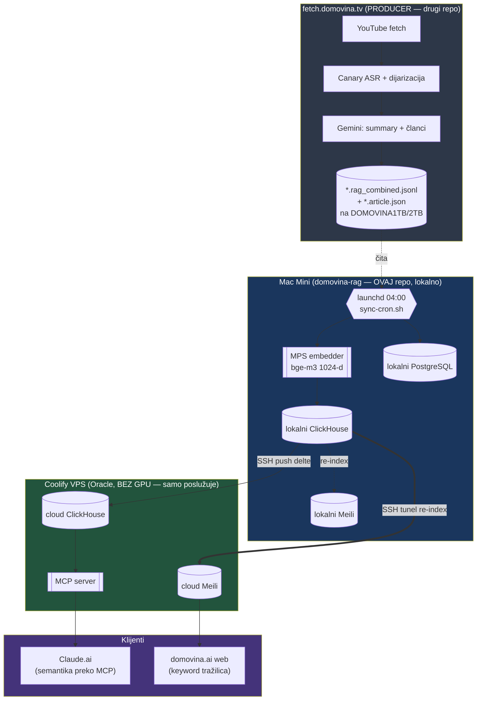
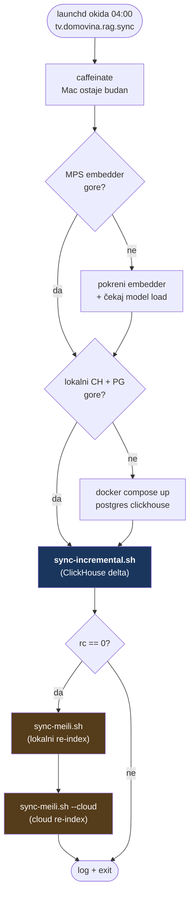
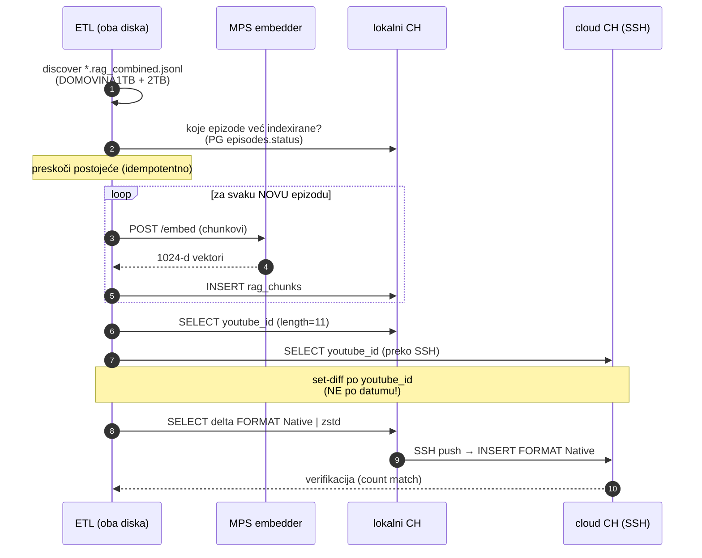
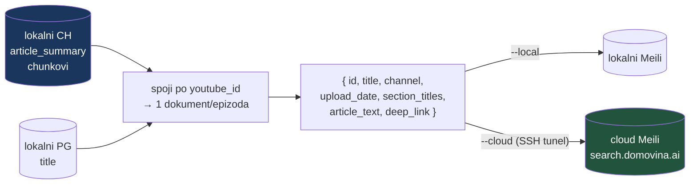
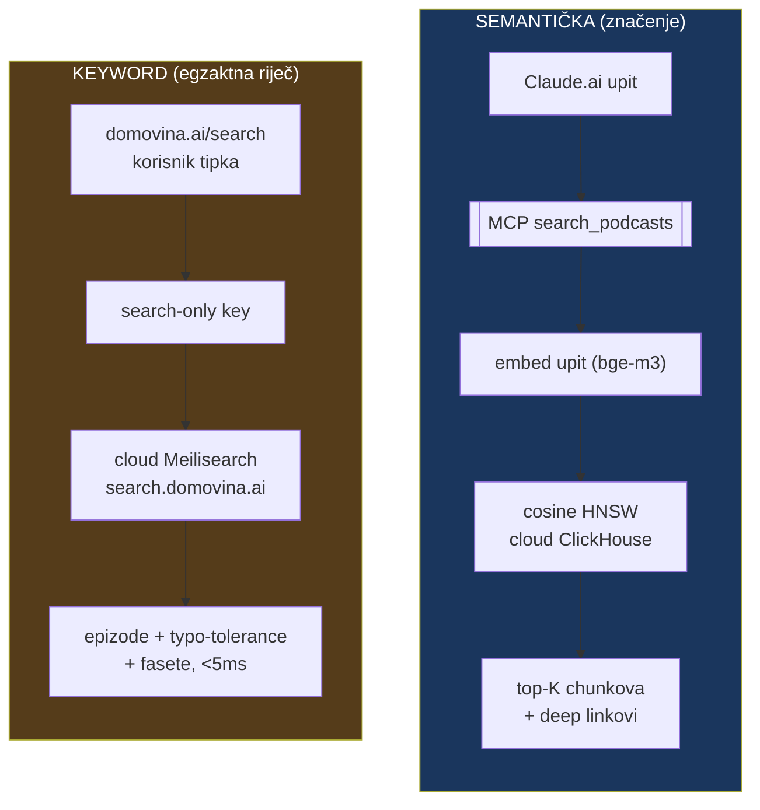
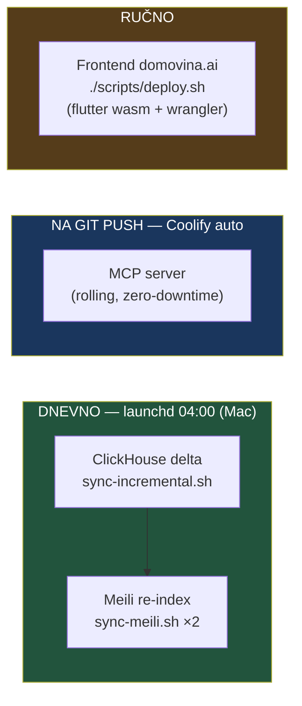
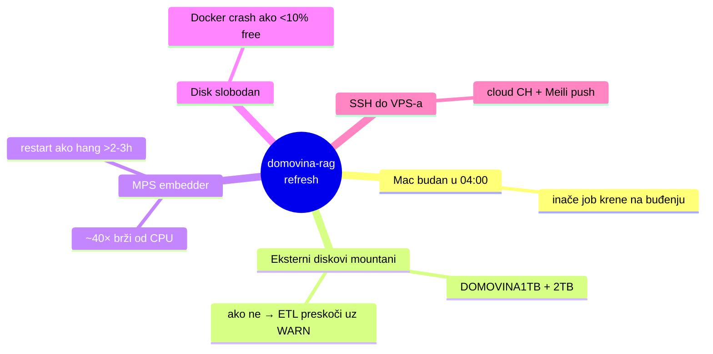

# Kako se domovina-rag osvježava

Vizualni pregled cijelog data-refresh ciklusa: od novog YouTube videa kod
producera do svježeg rezultata u semantičkoj (ClickHouse) i keyword (Meilisearch)
pretrazi na cloudu.

> **TL;DR:** Jedan dnevni launchd job na Macu (`04:00`) povuče nove epizode,
> embeda ih lokalno na MPS GPU, i pusha deltu u cloud ClickHouse + re-indeksira
> cloud Meilisearch. Cloud samo poslužuje — ne računa embeddinge.

---

## 1. Big picture — tko što radi



**Ključna odluka:** embedding je skup (bge-m3 je ~40× sporiji na CPU nego na
Apple MPS GPU), a cloud VPS nema GPU. Zato se sve računanje radi **lokalno na
Macu**, a cloud dobiva gotove podatke i samo ih poslužuje.

---

## 2. Dnevni ciklus — `sync-cron.sh` korak po korak



Preduvjeti za uspješan run: **Mac budan u 04:00** (ili job krene na buđenju —
launchd `StartCalendarInterval` semantika) i **eksterni diskovi mountani**
(DOMOVINA1TB/2TB; ako nisu, ETL ih preskoči uz WARN). Logovi:
`.ingest-logs/sync-cron-YYYYMMDD.log`.

---

## 3. ClickHouse delta — `sync-incremental.sh`

Srce semantičkog osvježavanja. Idempotentno, pusha samo NOVE epizode.



**Zašto set-diff po `youtube_id` a ne po datumu:** producer zna indeksirati
epizode naknadno — chunk sa starijim `upload_date` od cloud-maxa pojavi se tek
danas. Diff po datumu bi ga promašio. Filter `length=11` izbacuje korumpirane
youtube_id-eve (npr. λ orfan).

---

## 4. Meilisearch re-index — `sync-meili.sh`

Keyword tražilica. Index je **derivat ClickHouse-a** (ne zaseban izvor istine),
pa je puni re-index jeftin (~sekunde za 2562 dokumenta).



Dokument je **po epizodi** (ne po sekciji) — korisnik traži "koja epizoda priča o
X", pa uđe u nju. Searchable: `title`, `section_titles`, `article_text`.
Fasete: `channel`, `upload_date`.

---

## 5. Kako podaci stignu do klijenta (read path)

Dvije nezavisne pretrage, komplementarne — ne miješaju se:



| | Semantička (ClickHouse) | Keyword (Meilisearch) |
|---|---|---|
| Klijent | Claude / LLM preko MCP | čovjek u web UI |
| Upit | "iskustvo kliničke smrti" (značenje) | "Immaculée Ilibagiza" (točno ime) |
| Jako | konceptualna sličnost | egzaktni match, typo, fasete |

---

## 6. Frekvencija po komponenti



| Komponenta | Kada | Mehanizam |
|---|---|---|
| **ClickHouse** (semantika) | dnevno 04:00, delta | launchd → `sync-incremental.sh` → SSH push |
| **Meilisearch** (keyword) | dnevno 04:00, nakon CH | launchd → `sync-meili.sh --local && --cloud` |
| **MCP server** (kod) | na `git push` | Coolify auto-rebuild (rolling) |
| **Frontend** (domovina.ai) | ručno | `./scripts/deploy.sh` (wasm + wrangler Pages) |

---

## 7. Ručno pokretanje (kad ne želiš čekati 04:00)

```bash
cd ~/git/domovinatv/domovina-rag

# Cijeli dnevni ciklus odjednom (kao cron):
./scripts/sync-cron.sh

# Ili pojedinačno:
./scripts/sync-incremental.sh          # CH delta na cloud
./scripts/sync-incremental.sh --dry-run  # samo izračun delte, bez pisanja
./scripts/sync-meili.sh                # lokalni Meili re-index
./scripts/sync-meili.sh --cloud        # cloud Meili re-index
```

---

## 8. Ovisnosti i rizici



**Jedini SPOF je Mac** — sve računanje (embedding) ovisi o njemu. Cloud je čisti
poslužitelj. Ako Mac postane usko grlo, alternativa je embed na GPU box ili cron
na samom VPS-u (veći zahvat, budući sprint).

---

## Vezani dokumenti

- `scripts/sync-incremental.sh`, `scripts/sync-meili.sh`, `scripts/sync-cron.sh`
- `infra/launchd/tv.domovina.rag.sync.plist` — raspored
- `meili-keys-and-frontend.md` — Meili ključevi + frontend wiring
- `coolify-meili-application.md` — Meili deploy
- `cloud_deployment_plan.md` — opći cloud pattern (CF Tunnel, Traefik)
