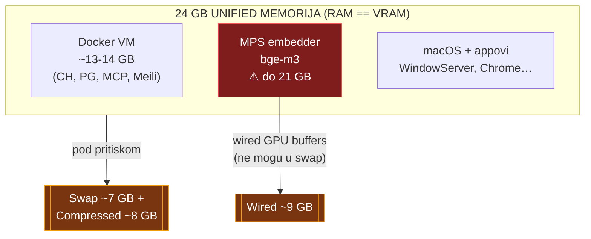
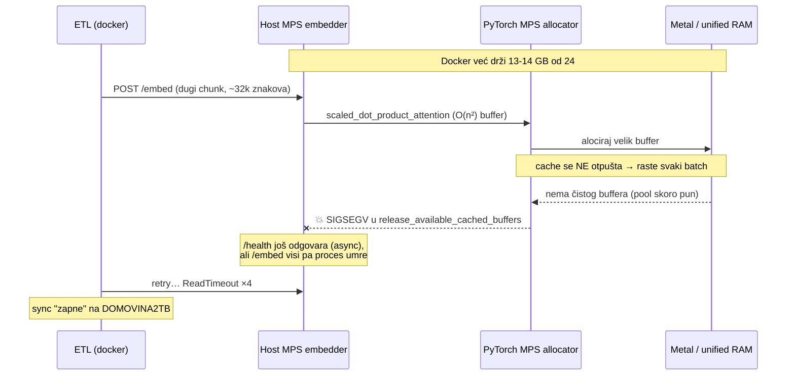
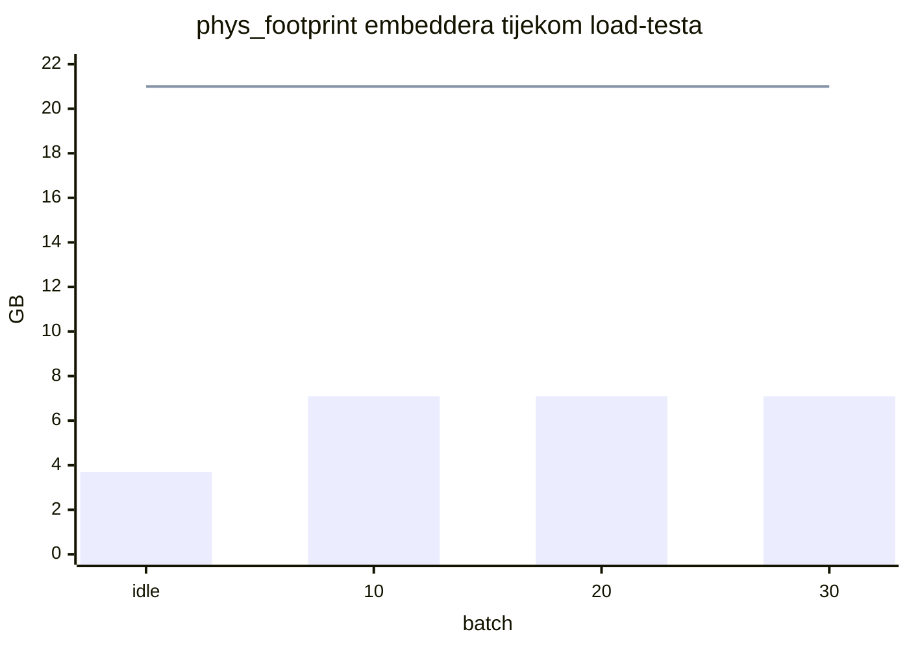
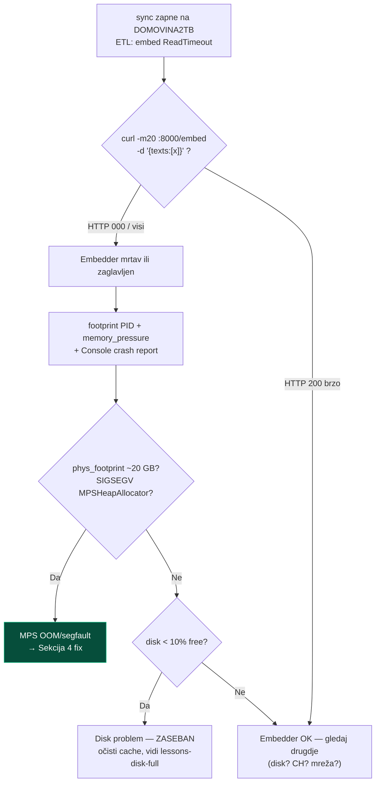

# MPS embedder i unified memorija (Apple Silicon)

> **TL;DR** — Na Apple Siliconu su RAM i VRAM **isti pool**. bge-m3 embedder na
> MPS-u zna narasti na ~20 GB (od 24) jer PyTorch MPS **neograničeno cache-a GPU
> buffere**, a attention je **O(n²)** po duljini teksta. Uz Docker koji uzima
> 13-14 GB → traži se 34 GB na 24 GB stroju → swap se puni, a MPS allocator
> **segfaulta** (`SIGSEGV` u `scaled_dot_product_attention`). Fix nije veći stroj
> nego **upravljanje memorijom**: `EMBEDDER_MAX_TEXT_LEN=8192`, mali batch,
> `torch.mps.empty_cache()` nakon svakog batcha. Rezultat: footprint 21 GB →
> plateau ~7 GB (težak load) / ~3.7 GB idle.

Ovaj dokument je nastao iz stvarne dijagnoze 2026-07-03 (dnevni `sync-cron` je
padao usred DOMOVINA2TB backfilla). Cilj: da sljedeći put ne gubimo sat na
re-dijagnozu. Vezano: [`lessons_smoke_test`], [`data-refresh-flow.md`].

---

## 1. Mentalni model: unified memorija

Na Apple Siliconu (ovdje M4 Pro, 24 GB) **nema odvojenog VRAM-a**. GPU (Metal/MPS),
CPU procesi i Docker VM dijele isti fizički pool. Kad jedan potrošač napuhne,
ostali idu u swap/kompresiju.



**Ključno:** MPS GPU alokacije su **wired** — ne mogu se komprimirati ni swapati.
Zato kad embedder napuhne, OS gura *sve ostalo* (Chrome, čak i dijelove Dockera)
u swap da napravi mjesta wired GPU memoriji. `13 GB Docker + 21 GB embedder = 34 GB`
na 24 GB stroju → sustav preživljava samo dok swap/kompresija stignu, a MPS
allocator na peak-u ne dobije čist buffer i **pukne**.

---

## 2. Zašto htop / `RES` lažu

Prva zamka: htop pokazuje embedder na **471 MB `RES`** i "12/24 GB used, puno
slobodno". To je **pogrešno** — MPS/Metal alokacije se knjiže kao IOAccelerator
(wired), **ne** kao process RSS.

| Alat / metrika | Pokazuje | Istina? |
|---|---|---|
| `htop` → `RES` | 471 MB | ❌ ne vidi GPU/wired |
| `htop` → `Mem` used | 12/24 GB | ❌ ne broji wired+compressed točno |
| Activity Monitor → per-proces "Memory" | **20.98 GB** | ✅ = `phys_footprint` |
| `footprint <pid>` → `phys_footprint` | **19-21 GB** | ✅ uključuje IOKit/GPU |
| `memory_pressure` → free % | 28% (ne 49%) | ✅ system-wide |
| Activity Monitor → **Memory Pressure graf** | žuto/crveno | ✅ **pravi signal** |
| Swap Used | 7 GB pun | ✅ dokaz pritiska |

### Kako mjeriti (copy-paste)

```bash
# PID host embeddera
EMB=$(lsof -nP -iTCP:8000 -sTCP:LISTEN | awk 'NR==2{print $2}')

# Pravi otisak (uključuje GPU/IOKit — ono što Activity Monitor zove "Memory")
footprint "$EMB" | grep -iE 'phys_footprint|IOAccelerator'
vmmap --summary "$EMB" | grep -iE 'Physical footprint|IOAccelerator'

# System-wide pritisak (NE 'free' bajtovi)
memory_pressure | tail -3
sysctl vm.swapusage

# GPU aktivnost (treba sudo)
sudo powermetrics --samplers gpu_power -i 1000
```

GUI: **Activity Monitor → Memory tab → graf "Memory Pressure"** (zeleno/žuto/crveno)
je pravi indikator, plus **Window → GPU History**.

---

## 3. Mehanizam pada



**Simptom koji vara:** izgleda kao *hang* (`/health` = `loaded:true`, `/embed`
visi, ETL u ReadTimeout retry-loopu), a zapravo je **segfault**. Potvrda u crash
reportu (`~/Library/Logs/DiagnosticReports/Python-*.ips`):

```
Thread N Crashed:  EXC_BAD_ACCESS (SIGSEGV) at 0x10
  at::mps::HeapAllocator::MPSHeapAllocatorImpl::release_available_cached_buffers
  ← at::native::_scaled_dot_product_attention_math_mps   (metal gpu stream)
```

### Dvoslojni uzrok
1. **Attention O(n²)** — `EMBEDDER_MAX_TEXT_LEN=32768` na rijetkom jako dugom
   chunku napravi golem buffer.
2. **Neograničen MPS cache** — PyTorch MPS drži svaki alocirani buffer; kroz
   stotine batcheva footprint naraste na ~20 GB.

---

## 4. Fix (bez novog stroja)

| Lever | Gdje | Vrijednost | Učinak |
|---|---|---|---|
| `EMBEDDER_MAX_TEXT_LEN` | `scripts/sync-cron.sh`, `run-embedder-host.sh` | 32768 → **8192** | manji attention buffer (O(n²)) |
| ETL batch | `scripts/sync-incremental.sh` (`ETL_BATCH`) | 4 → **2** | manje paralelnih sekvenci po pozivu |
| `torch.mps.empty_cache()` | `services/embedder/app/model.py` (nakon `encode`) | — | **omeđi cache** — footprint plateau, ne curi |

```python
# services/embedder/app/model.py — nakon self._model.encode(...)
if self.device == "mps":
    try:
        import torch
        torch.mps.empty_cache()   # otpusti cache nakon svakog batcha
    except Exception:
        pass
```

> ⚠️ **NE** koristi `PYTORCH_MPS_HIGH_WATERMARK_RATIO=0.7` — PyTorch ima i *low*
> watermark (default 1.4); high < low ruši startup s `RuntimeError: invalid low
> watermark ratio`. `empty_cache()` je dovoljan i siguran.
>
> **Ali to vrijedi samo za ENV VARIJABLU.** Python API
> `torch.mps.set_per_process_memory_fraction(f)` ne prolazi kroz istu validaciju i
> radi bez sukoba s low watermarkom — provjereno na torch 2.11 za f = 0,21 / 0,32
> / 0,42. Od 04.08. se koristi baš on (§6), pa ovo upozorenje NIJE razlog da ga se
> makne.

### Validacija (2026-07-03)

Load-test: 40 batcheva × 8 tekstova × ~8000 znakova.



Plavi bar = s fixom (**plateau ~7 GB**). Referentna linija = prije fixa (raslo
prema **21 GB** i segfault). Idle nakon load-a padne natrag na ~3.7 GB.

---

## 5. Dijagnostički flowchart (za sljedeći put)



**Bitno razlučivanje:** disk-full crash i MPS-segfault su **dva odvojena
problema** koja su se poklopila. Disk se rješava čišćenjem cache-eva (Library/git
kitovi na internom disku); MPS se rješava upravljanjem memorijom. Ne miješaj ih.

---

## 6. Limit po tokenima, ne po znakovima (2026-08-03)

Fix iz §4 (`EMBEDDER_MAX_TEXT_LEN=8192`) zaustavio je padove, ali je uveo tihu
cijenu: **75 epizoda se od 14.07. uopće nije uspjelo ingestirati.** U cron logu
je to bilo `413 Content Too Large` uz `Greška na … — nastavljam dalje`, pa je
izgledalo kao rubni slučaj, a bilo je 2061 chunk.

### Zašto je limit u znakovima bio kriva mjera

`len(text)` nije ono što košta — košta broj **tokena**. Za hrvatski je omjer
~3,9 znaka/token, pa je limit od 8192 znaka propuštao tek **~2100 tokena**, dok
bge-m3 podnosi 8192. Rezali smo na četvrtini kapaciteta modela.

Mjereno nad 136 odbijenih chunkova: **nijedan ne prelazi model** — najdulji ima
7877 tokena. Svi su bili odbijeni mjerom koja s modelom nema veze.

### Ali podizanje limita nije rješenje — to je izmjereno na teži način

| konfiguracija | ishod |
|---|---|
| batch=1, n=7877 tokena | prošlo, 15,9 s, **MPS driver peak 15,13 GB** |
| batch=4, n=7877 tokena | `RuntimeError: Invalid buffer size: 14.80 GiB` |
| batch=4, n=2100 tokena | 4,30 GB — stara postavka, stabilna tjednima |

Prvi red je **zamrznuo stroj**: 15,13 GB na 26 GB unified od kojih Docker drži
14,6 GB znači da OS nema što osloboditi → kompresor + swap.

Iz toga izlazi model troška. Attention drži `(batch, glave, n, n)` u float32,
bge-m3 ima 16 glava, a unutar koraka živi ~3,8 kopija:

```
peak_bytes ≈ 16 × 4 × 3,81 × batch × n²  ≈  244 × batch × n²
```

**Trošak je kvadratan po duljini, a linearan po batchu.** Limit zato ne može biti
broj po tekstu — mora biti budžet nad `batch × n²`.

### Treća zamka: padding na najdulji u batchu

`SentenceTransformer.encode` padira **cijeli batch na najdulji član**. Batch od 4
u kojem je jedan chunk od 7877 tokena košta kao četiri takva, i to je točno ono
što je srušilo stroj pri mjerenju. Zato `model.py` sortira silazno prije
grupiranja — slični završe zajedno i padding se ne plaća.

### Što je sada

| Lever | Vrijednost | Uloga |
|---|---|---|
| `EMBEDDER_MEM_BUDGET_GB` | **4,5** (host MPS), 8 (CPU kontejner) | budžet nad `244 × batch × n²` |
| `EMBEDDER_MAX_TEXT_LEN` | **ukinut** | ako ostane u env-u → WARNING, ignorira se |
| `EMBEDDER_MAX_TEXT_CHARS` | 500000 | gruba brana da se ne tokenizira cijeli fajl |
| `EMBEDDER_MPS_CAP_GB` | **8,0** | **tvrda** kapica alokacije procesa (vidi niže) |

### Budžet je model, kapica je kočnica

`_plan_batches` je RAČUNSKI model izveden iz mjerenja — dobar, ali allocator ga
ne obvezuje ni na što. Zato od 04.08. `load()` postavlja i
`torch.mps.set_per_process_memory_fraction(cap / recommended_max_memory)`
(torch ≥ 2.1; ovdje 2.11, `recommended_max_memory` = 19,1 GB).

Razlika je bitna: bez kapice prekoračenje znači da macOS počne swapati i cijeli
stroj stane, jer MPS alokacije dolaze iz istog DRAM-a kao OS. S kapicom PyTorch
digne `RuntimeError` — padne POJEDINI request, a stroj ostane živ.

Kapica je namjerno LABAVIJA od budžeta (8 vs 4,5 GB): njoj nije posao upravljati
batchevima nego biti zadnja brana ako model troška podbaci. Pokriva težine
bge-m3 (~2,3 GB fp32) + attention budžet + aktivacije.

Default 4,5 GB nije procjena nego **izmjereni peak stare, dokazano stabilne
postavke** (batch 4 × 2100 tokena = 4,30 GB). Između nje i 15,13 GB nema
mjerenja, pa default ostaje na donjoj — podigni ga tek kad se potvrdi stabilnost.

Iz budžeta ispada tvrdi limit `n ≤ √(budžet / 244)` = **4295 tokena**; tekst
iznad toga ne stane ni sam i jedini je preostali 413.

### Učinak

| | prije | poslije |
|---|---|---|
| chunkova koji prolaze (od 2061) | 1925, ali **odbačeni s epizodom** | **2058 (99,9 %)** |
| epizoda u korpusu | 0 od 75 | 72 potpuno, 3 djelomično |

Drugi dio dobitka je u ETL-u: `embed_lenient` (`services/etl/etl/embed.py`) na
413 degradira batch na pojedinačne pozive i preskoči **samo** krivi chunk, uz
`WARNING` s `youtube_id`. Prije je jedan predugi chunk odbacivao cijelu epizodu.
Guta se isključivo 413 — 500 i connection error i dalje pucaju, jer bi tiho
preskakanje proizvelo epizodu s nevidljivim rupama.

### Što ostaje

Cjelovit uzročni lanac kroz tri repoa, zamka „kod commitan a neprimijenjen" i
cijena regeneracije: **`2026-08-04-ingest-lanac-i-regeneracija.md`**.

Tri chunka i dalje ne prolaze jer su `topic_transcript` segmenti od ~30 minuta
(`00:20:30–00:50:00` u jednom komadu, 118 od 136 predugih dolazi s `subclub`).
To je **producerov** posao — chunker u `fetch.domovina.tv` ne bi smio emitirati
polusatni chunk, koji je uz to i loš rezultat pretrage.

---

## 7. Kad ipak razmisliti o hardveru

24 GB M4 Pro je **dovoljan** za dnevni delta-embed s bge-m3 kad je memorija
upravljana. Više RAM-a (48-64 GB) je *nice-to-have*, ne nužnost, i to tek za:

- full-corpus re-embed + reranker + veći modeli **paralelno**,
- držati cijeli Docker stack **i** težak MPS embedder istovremeno bez ikakvog swapa.

Prije kupovine, jeftini leveri: `empty_cache()` (gore), smanji Docker RAM
alokaciju (`~/Library/Group Containers/group.com.docker/settings-store.json` →
`MemoryMiB`, RAG stack treba ~3-4 GB), ili `EMBEDDER_DEVICE=cpu` (stabilno,
~40× sporije).
