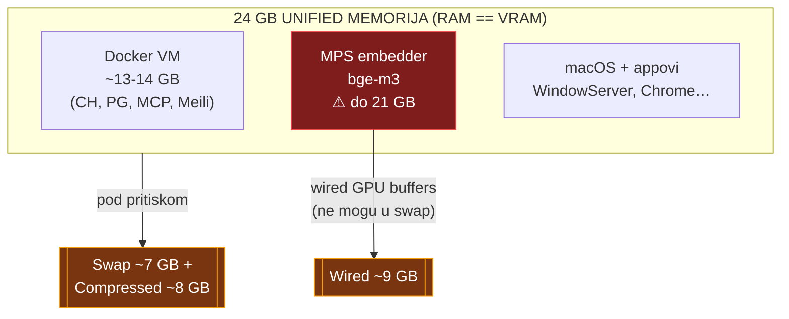
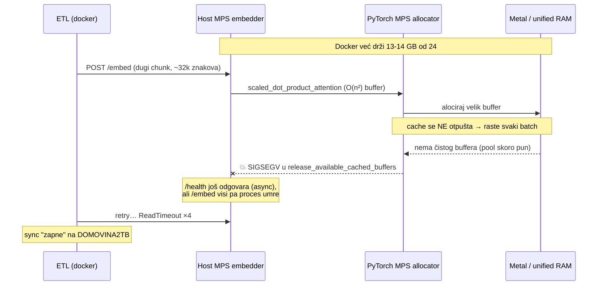
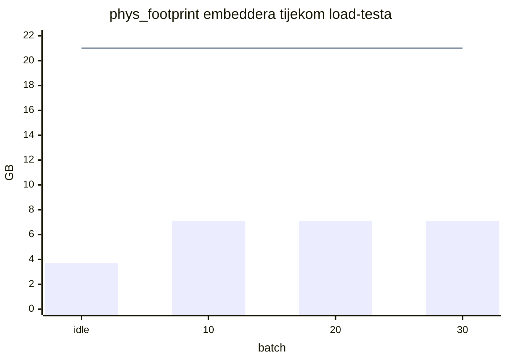
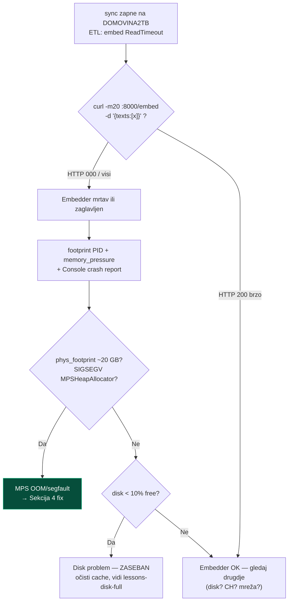

# MPS embedder i unified memorija (Apple Silicon)

> **TL;DR** — Na Apple Siliconu su RAM i VRAM **isti pool**. bge-m3 embedder na
> MPS-u zna narasti na ~20 GB (od 24) jer PyTorch MPS **neograničeno cache-a GPU
> buffere**, a attention je **O(n²)** po duljini teksta. Uz Docker koji uzima
> 13-14 GB → traži se 34 GB na 24 GB stroju → swap se puni, a MPS allocator
> **segfaulta** (`SIGSEGV` u `scaled_dot_product_attention`). Fix nije veći stroj
> nego **upravljanje memorijom**: `EMBEDDER_MAX_TEXT_LEN=8192`, mali batch,
> `torch.mps.empty_cache()` nakon svakog batcha. Rezultat: footprint 21 GB →
> plateau ~7 GB (težak load) / ~3.7 GB idle.

Ovaj dokument je nastao iz stvarne dijagnoze 2026-07-03 (dnevni `sync-cron` je
padao usred DOMOVINA2TB backfilla). Cilj: da sljedeći put ne gubimo sat na
re-dijagnozu. Vezano: [`lessons_smoke_test`], [`data-refresh-flow.md`].

---

## 1. Mentalni model: unified memorija

Na Apple Siliconu (ovdje M4 Pro, 24 GB) **nema odvojenog VRAM-a**. GPU (Metal/MPS),
CPU procesi i Docker VM dijele isti fizički pool. Kad jedan potrošač napuhne,
ostali idu u swap/kompresiju.



**Ključno:** MPS GPU alokacije su **wired** — ne mogu se komprimirati ni swapati.
Zato kad embedder napuhne, OS gura *sve ostalo* (Chrome, čak i dijelove Dockera)
u swap da napravi mjesta wired GPU memoriji. `13 GB Docker + 21 GB embedder = 34 GB`
na 24 GB stroju → sustav preživljava samo dok swap/kompresija stignu, a MPS
allocator na peak-u ne dobije čist buffer i **pukne**.

---

## 2. Zašto htop / `RES` lažu

Prva zamka: htop pokazuje embedder na **471 MB `RES`** i "12/24 GB used, puno
slobodno". To je **pogrešno** — MPS/Metal alokacije se knjiže kao IOAccelerator
(wired), **ne** kao process RSS.

| Alat / metrika | Pokazuje | Istina? |
|---|---|---|
| `htop` → `RES` | 471 MB | ❌ ne vidi GPU/wired |
| `htop` → `Mem` used | 12/24 GB | ❌ ne broji wired+compressed točno |
| Activity Monitor → per-proces "Memory" | **20.98 GB** | ✅ = `phys_footprint` |
| `footprint <pid>` → `phys_footprint` | **19-21 GB** | ✅ uključuje IOKit/GPU |
| `memory_pressure` → free % | 28% (ne 49%) | ✅ system-wide |
| Activity Monitor → **Memory Pressure graf** | žuto/crveno | ✅ **pravi signal** |
| Swap Used | 7 GB pun | ✅ dokaz pritiska |

### Kako mjeriti (copy-paste)

```bash
# PID host embeddera
EMB=$(lsof -nP -iTCP:8000 -sTCP:LISTEN | awk 'NR==2{print $2}')

# Pravi otisak (uključuje GPU/IOKit — ono što Activity Monitor zove "Memory")
footprint "$EMB" | grep -iE 'phys_footprint|IOAccelerator'
vmmap --summary "$EMB" | grep -iE 'Physical footprint|IOAccelerator'

# System-wide pritisak (NE 'free' bajtovi)
memory_pressure | tail -3
sysctl vm.swapusage

# GPU aktivnost (treba sudo)
sudo powermetrics --samplers gpu_power -i 1000
```

GUI: **Activity Monitor → Memory tab → graf "Memory Pressure"** (zeleno/žuto/crveno)
je pravi indikator, plus **Window → GPU History**.

---

## 3. Mehanizam pada



**Simptom koji vara:** izgleda kao *hang* (`/health` = `loaded:true`, `/embed`
visi, ETL u ReadTimeout retry-loopu), a zapravo je **segfault**. Potvrda u crash
reportu (`~/Library/Logs/DiagnosticReports/Python-*.ips`):

```
Thread N Crashed:  EXC_BAD_ACCESS (SIGSEGV) at 0x10
  at::mps::HeapAllocator::MPSHeapAllocatorImpl::release_available_cached_buffers
  ← at::native::_scaled_dot_product_attention_math_mps   (metal gpu stream)
```

### Dvoslojni uzrok
1. **Attention O(n²)** — `EMBEDDER_MAX_TEXT_LEN=32768` na rijetkom jako dugom
   chunku napravi golem buffer.
2. **Neograničen MPS cache** — PyTorch MPS drži svaki alocirani buffer; kroz
   stotine batcheva footprint naraste na ~20 GB.

---

## 4. Fix (bez novog stroja)

| Lever | Gdje | Vrijednost | Učinak |
|---|---|---|---|
| `EMBEDDER_MAX_TEXT_LEN` | `scripts/sync-cron.sh`, `run-embedder-host.sh` | 32768 → **8192** | manji attention buffer (O(n²)) |
| ETL batch | `scripts/sync-incremental.sh` (`ETL_BATCH`) | 4 → **2** | manje paralelnih sekvenci po pozivu |
| `torch.mps.empty_cache()` | `services/embedder/app/model.py` (nakon `encode`) | — | **omeđi cache** — footprint plateau, ne curi |

```python
# services/embedder/app/model.py — nakon self._model.encode(...)
if self.device == "mps":
    try:
        import torch
        torch.mps.empty_cache()   # otpusti cache nakon svakog batcha
    except Exception:
        pass
```

> ⚠️ **NE** koristi `PYTORCH_MPS_HIGH_WATERMARK_RATIO=0.7` — PyTorch ima i *low*
> watermark (default 1.4); high < low ruši startup s `RuntimeError: invalid low
> watermark ratio`. `empty_cache()` je dovoljan i siguran.

### Validacija (2026-07-03)

Load-test: 40 batcheva × 8 tekstova × ~8000 znakova.



Plavi bar = s fixom (**plateau ~7 GB**). Referentna linija = prije fixa (raslo
prema **21 GB** i segfault). Idle nakon load-a padne natrag na ~3.7 GB.

---

## 5. Dijagnostički flowchart (za sljedeći put)



**Bitno razlučivanje:** disk-full crash i MPS-segfault su **dva odvojena
problema** koja su se poklopila. Disk se rješava čišćenjem cache-eva (Library/git
kitovi na internom disku); MPS se rješava upravljanjem memorijom. Ne miješaj ih.

---

## 6. Kad ipak razmisliti o hardveru

24 GB M4 Pro je **dovoljan** za dnevni delta-embed s bge-m3 kad je memorija
upravljana. Više RAM-a (48-64 GB) je *nice-to-have*, ne nužnost, i to tek za:

- full-corpus re-embed + reranker + veći modeli **paralelno**,
- držati cijeli Docker stack **i** težak MPS embedder istovremeno bez ikakvog swapa.

Prije kupovine, jeftini leveri: `empty_cache()` (gore), smanji Docker RAM
alokaciju (`~/Library/Group Containers/group.com.docker/settings-store.json` →
`MemoryMiB`, RAG stack treba ~3-4 GB), ili `EMBEDDER_DEVICE=cpu` (stabilno,
~40× sporije).
