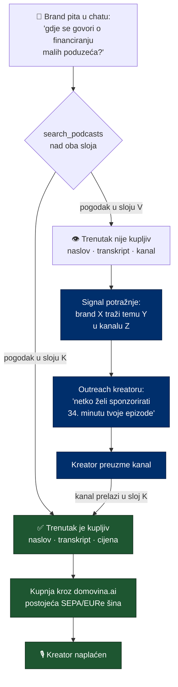

# Podcasterium — od hrvatskog korpusa do svjetskog, i zašto to nije pretraga

> Status: **plan, nije predano.** Mjereno nad živim servisom 26.8.2026.
> Prateći dokumenti u `domovina.ai` repou:
> [`docs/plans/2026-08-26-p2p-oglasni-prostor.md`](../../../domovina.ai/docs/plans/2026-08-26-p2p-oglasni-prostor.md)
> (mehanizam prodaje trenutka) i
> [`docs/oglasni-prostor-trziste-i-usporedba.md`](../../../domovina.ai/docs/oglasni-prostor-trziste-i-usporedba.md)
> (tržište i pravni okvir).

Teza u jednoj rečenici: **Podcasterium nije tražilica podcasta nego jedina
tražilica u kojoj rezultat ima gumb „kupi".**

---

## 1. Što već stoji

Mjereno `server_info` alatom nad produkcijom (`mcp.domovina.link`), 26.8.2026.:

```
channels 48 · episodes 3.157 · chunks 144.294
raspon    2016-02-18 → 2026-07-30
tools     search_podcasts · list_channels · list_episodes · get_episode
          count_mentions · get_person · server_info
```

*(README još navodi metu od „~92K chunkova / 1843 epizode" — zastarjelo, treba
ispraviti.)*

Arhitektura je **već ona koja treba**: ClickHouse `ReplacingMergeTree` s
`vector_similarity('hnsw','cosineDistance')` nad 1024-d `bge-m3` vektorima,
PostgreSQL kao transakcijska istina, ETL iz `fetch.domovina.tv`, R2 snapshot →
Coolify read-only serve, MCP preko Streamable HTTP + javni `/api/search`.

**Za Podcasterium se arhitektura ne mijenja.** Mijenjaju se tri stvari: izvor,
jezik i namjena. Zato tehnički rizik nije u srži nego na rubovima — i rubovi su
u §5.

---

## 2. Dijagnoza: „korpus podcasta cijelog svijeta" je zauzet

| tko | što radi | cijena |
|---|---|---|
| **Podscan.fm** | transkribira **4M+ podcasta unutar ~10 min od objave**, sve riječi pretražive, brand alerti sa sentimentom | od **100 $/mj**, enterprise **5.000 $/mj** |
| **Podchaser Pro** | baza emisija + brand intelligence | demo/quote, izvješteno ~2.500–5.000 $/god naviše |
| **Rephonic, Listen Notes** | pretraga i metapodaci | niže |
| **Podcast Index** | **~4M feedova, otvoreni API, besplatno** | 0 |

Dakle: ni katalog ni transkripcija ni pretraga **nisu prednost**. Ako je
Podcasterium „pretraži svjetski korpus", ulazi u kategoriju s inkumbentom koji
ima četiri milijuna podcasta prednosti i ulaznu cijenu od sto dolara.

**Ali njihov proizvod staje točno gdje naš počinje.** Podscan brandu kaže
„spomenuti ste". Ne može mu prodati taj trenutak. Nitko ne može — to je isti
nalaz iz istraživanja oglasnog tržišta: kontekstualni dobavljači ocjenjuju
epizodu, alati za reklamne pauze traže tišinu, a odabir **točnog semantičkog
trenutka** ne postoji ni kod koga.

> **Rule (drži ovo u glavi kroz cijeli razvoj)**: RAG nije jarak. Jarak je
> mogućnost transakcije. Svaka odluka koja poboljšava pretragu a ne približava
> transakciju je odgođeni posao, ne napredak.

---

## 3. Zamka koja ubija demo, i dvoslojni korpus kao odgovor

Ako je korpus svijet, brand pretraži, nađe savršenu minutu kod emisije koju
**ne možemo prodati**, i razgovor umre u trenutku najvećeg oduševljenja.

Zato korpus ima **dva sloja s različitim ugovorom prema korisniku**:

| | **Sloj K — kupljivo** | **Sloj V — vidljivo** |
|---|---|---|
| Što je | kanali u našem pipelineu, sa slot mapama | svjetski korpus iz RSS-a |
| Obrada | puni pipeline (ASR + dijarizacija + članak) | **samo ASR + embeddings** |
| U rezultatu | „Kupi ovaj trenutak" | „Javi kreatoru da ga brand traži" |
| Tko plaća obradu | mi, jer se monetizira | mi, ali po najnižem trošku |

Drugi red je najvrjedniji dio cijelog plana. **Brandova pretraga postaje naša
lista za outreach**: potražnja povlači ponudu umjesto da je lovimo hladnim
mailovima. Podscan to strukturno ne može imati jer nema što prodati.



**Rule**: rezultat iz sloja V **nikad ne smije izgledati kao da je kupljiv.**
Lažna ponuda oglasnog prostora nad tuđim sadržajem nije samo loš UX nego i
pravni problem — isto pravilo koje u `domovina.ai` zabranjuje ugrađivanje
proizvoljnog YouTube videa pod našim brandom.

---

## 4. Shema je danas vezana uz YouTube — to je prvi posao

Ovo nije stilska primjedba nego blokator. Iz `infra/clickhouse/init.sql`:

```sql
CREATE TABLE IF NOT EXISTS rag_chunks (
    chunk_id        String,
    episode_id      UInt64,
    youtube_id      String,                    -- ⛔ izvor je ugrađen u shemu
    channel         LowCardinality(String),    -- ⛔ krivo za >10K emisija
    ...
    embedding       Array(Float32) CODEC(NONE),
    INDEX idx_embedding embedding TYPE vector_similarity('hnsw','cosineDistance')
) ENGINE = ReplacingMergeTree(inserted_at)
```

Četiri konkretna nalaza:

| nalaz | zašto smeta | prijedlog |
|---|---|---|
| `youtube_id String` je jedini identitet izvora | svjetski korpus je RSS — emisije imaju feed URL i item GUID, ne YouTube ID | `source_kind` (`youtube` \| `rss`) + `source_id` (GUID/ytId) + `feed_url`; `youtube_id` ostaje kao izvedeni pogled radi kompatibilnosti |
| **nema `lang` stupca** | ne može se filtrirati ni usmjeriti po jeziku, a svjetski korpus je višejezičan | `lang LowCardinality(String)` (ISO 639-1), popunjava ga ASR |
| **nema oznake sloja** | ne razlikuje kupljivo od vidljivog (§3) | `tier LowCardinality(String)` (`sellable` \| `discoverable`) |
| `channel LowCardinality(String)` | `LowCardinality` je namijenjen niskoj kardinalnosti (praktični red veličine < 10K distinktnih vrijednosti); za 100K+ emisija degradira | `channel String` + zaseban `show_id UInt64` s FK-om u PG |

**Rule**: `bge-m3` je već višejezičan i to je sretna okolnost — model se **ne
mijenja**. Mijenja se samo ono što ga okružuje.

### Aritmetika prostora, jer odlučuje

Iz živih brojki: 144.294 chunka na ~3.047 sati korpusa → **~47 chunkova po satu**.
Vektor je 1024 × Float32 = **4 KB** (`CODEC(NONE)`), dakle **~192 KB vektora po
satu zvuka**.

| korpus | chunkova | samo vektori |
|---|---|---|
| danas (3.047 h) | 144 K | ~0,6 GB |
| 100.000 h | ~4,7 M | ~19 GB |
| 1.000.000 h | ~47 M | **~192 GB** |

To je bez teksta, bez HNSW režije i bez replika. **Sloj V zato ne smije nositi
`text_summary` ni `metadata` raw JSON** — samo ono što treba za dohvat.

---

## 5. Trošak i višejezičnost — dvije stvari koje odlučuju hoće li ovo postojati

### 5.1 Puni pipeline ne smije na svjetski korpus

Sloj V dobiva **samo ASR + chunking + embedding**. Bez dijarizacije, bez
Gemini sažetka, bez članka, bez Magisteriuma, bez screenshotova. To je jedini
način da trošak po satu padne na razinu na kojoj svjetski korpus ima smisla.

**[TREBA IZMJERITI]** stvarni trošak po satu za jeftini sloj iz vlastitog Modal
računa, prije nego se ijedna brojka o skaliranju stavi u pitch. Ne procjenjuj —
prvih 100 sati nekog stranog kanala je dovoljno da se dobije mjerena cijena.

### 5.2 Hrvatski izlaz je najveći pojedinačni posao

Pipeline danas producira **hrvatski izlaz bez obzira na jezik izvora** — to je
već zapisano kao najveća prepreka globalizaciji. Za Podcasterium to ne prolazi:
brand koji traži engleski sadržaj mora dobiti engleski citat, a ne prijevod.

Za sloj V to je zapravo **lakše nego što zvuči**, jer sloj V nema članak ni
sažetak — ima samo transkript, a transkript je već na izvornom jeziku. Problem
postoji tek kad kanal pređe u sloj K. Dakle:

> **Rule**: višejezičnost se rješava **na prijelazu K←V**, ne na ulazu u korpus.
> Sloj V je jezično neutralan po konstrukciji.

---

## 6. Brand-chat — što se točno gradi, i nad čime

Frontend je **tanak**. Sve što mu treba već postoji:

| treba | postoji |
|---|---|
| semantička pretraga | `search_podcasts` + `/api/search` (GET i POST, CORS) |
| pregled korpusa | `list_channels`, `list_episodes` |
| kontekst epizode | `get_episode` |
| mjerenje spominjanja branda | **`count_mentions`** — već je tu |
| deep link na sekundu | chunk nosi `start_ts` |

Novo je samo troje:

1. **Sloj razgovora** — LLM koji brandov opis proizvoda pretvara u upite i
   rangira trenutke po prikladnosti, ne po sličnosti. („Mi prodajemo
   knjigovodstveni software malim obrtima" → tri upita, pa sinteza.)
2. **Filtar po sloju i cijeni** — `tier`, `lang`, dostupnost slota.
3. **Prijelaz u kupnju** — rezultat iz sloja K vodi na `/v/:id/sponzoriraj` u
   `domovina.ai`.

**Rule (protiv konvencije ovog repoa)**: `CLAUDE.md` kaže *„nemoj premature
dodavati frontend kod — primarni frontend je domovina.ai repo, ili Claude.ai kao
MCP klijent."* Brand-chat **jest** iznimka od tog pravila, ali ne mijenja ga:
ide u `services/` kao zaseban servis s vlastitom domenom, **ne** u MCP server.
MCP ostaje čist alat-sloj.

---

## 7. Pravna osnova korpusa

RSS daje pravo **dohvata radi reprodukcije**. Transkribiranje i indeksiranje
stoji na nečem drugom — na **TDM iznimci** iz DSM direktive (čl. 4 dopušta
komercijalni text-and-data-mining osim ako je nositelj prava izričito rezervirao
prava **u strojno čitljivom obliku**).

Iz toga slijede tri obveze koje moraju biti u proizvodu od prvog dana, ne
naknadno:

1. **Poštovati rezervaciju prava** — `robots.txt`, oznake na razini feeda, i
   evidencija tko je što rezervirao.
2. **Opt-out koji stvarno radi** — kreator mora moći izaći iz sloja V jednim
   zahtjevom, i to se mora vidjeti u podacima, ne samo u UI-ju.
3. **Vraćati isječke, ne cijele transkripte** — sloj V daje citat s deep linkom,
   nikad puni tekst epizode. `get_episode` s punim transkriptom ostaje **samo za
   sloj K**.

**[TREBA ODVJETNIK]** prije faze 1: vrijedi li čl. 4 TDM iznimke za korpus koji
se komercijalno pretražuje, i je li „isječak + deep link" dovoljno za pozivanje
na pravo citiranja. Napomena: **u SAD-u je pravna osnova druga** (fair use), pa
odgovor za EU ne vrijedi automatski za američki sadržaj.

---

## 8. Faze

| faza | opseg | ovisi o |
|---|---|---|
| **0. Shema** | `source_kind`/`source_id`/`feed_url`, `lang`, `tier`, `show_id`; migracija postojećih 144K chunkova; `youtube_id` kao izvedeni pogled | ničemu |
| **1. RSS ingest** | Podcast Index kao katalog, jeftini ASR sloj, opt-out registar. **Dokaz na jednoj stranoj vertikali**, ne na cijelom svijetu | 0 |
| **2. Brand-chat** | zaseban servis nad postojećim `/api/search`; filtri po `tier`/`lang`; još bez kupnje | 1 |
| **3. Flywheel** | signal potražnje iz sloja V → outreach kreatoru → preuzimanje kanala | 2 + ownership tok u `domovina.ai` |
| **4. Spoj s tržištem** | gumb „kupi" nad slojem K, vezan na slot mape | 3 + faza 2 oglasnog plana |

Faza 0 je jedini posao koji se **isplati napraviti čak i ako Podcasterium nikad
ne nastane** — shema vezana uz jedan izvor je dug bez obzira na ovaj plan.

---

## 9. Otvorena pitanja

1. **Koja je prva strana vertikala?** Treba jedna, s malo emisija i jasnim
   brandovima. (Prijedlog: nešto usko i englesko, gdje je oglašivač očit.)
2. **Ide li Podcasterium na vlastitu domenu i vlastiti MCP**, ili je to isti
   servis s drugim brandom? (Prijedlog: isti servis, `tier` filtar, jedna baza —
   dvije baze znače dvije sinkronizacije i tiho raspadanje.)
3. **Kako se rangira „isplativost" trenutka?** Semantička sličnost nije to.
   Treba li uopće ocjena, ili je dovoljno pokazati kontekst i pustiti brand da
   sam odluči? (Prijedlog: u početku bez ocjene — izmišljena ocjena je gori
   proizvod od poštenog popisa.)
4. **Što s emisijama koje već imaju oglase?** Naš trenutak može pasti preko
   tuđeg baked-in sponzorstva.
5. **Ime.** `Podcasterium` nasljeđuje logiku `Magisteriuma` (kanonski korpus,
   citirani odgovor). Radi li ta asocijacija izvan hrvatskog katoličkog kruga?

---

## 10. Što NE raditi

- **Nemoj krenuti od širine korpusa.** Milijun sati bez ijednog kupljivog
  trenutka je trošak, ne proizvod. Jedna vertikala u kojoj netko plati vrijedi
  više od cijelog svijeta u kojem nitko ne plati.
- **Nemoj graditi brand-chat unutar MCP servera.** MCP je alat-sloj i mora
  ostati upotrebljiv iz Claudea, ChatGPT-a i Cursora.
- **Nemoj kopirati puni pipeline na sloj V.** To je jedini način da trošak
  eksplodira prije prve uplate.
- **Nemoj obećati kupnju nad sadržajem koji ne kontroliramo** (§3).
- **Nemoj mijenjati `bge-m3`.** Već je višejezičan; problem nije model.
