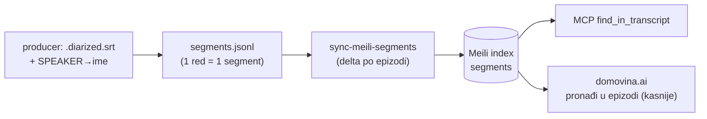

# Plan: pretraga sirovog transkripta s točnom sekundom (Meili `segments`)

Status: **LIVE** (06.10.2026.) — producer `8f0f3de4`, consumer `fa3105b` + `2e0fae6`,
MCP v0.10.0 na produkciji, cloud index napunjen, e2e protiv prod-a 40/40.

## Problem

Pitanje tipa „u kojem trenutku snimatelj Matija ulazi u kadar u epizodi X" danas
nema pouzdan odgovor ni kroz MCP ni kroz web, iako je odgovor doslovno izgovoren
u transkriptu.

Test slučaj: epizoda `35Oq01CmGWE` (`40_dana_za_zivot`, „SVJEDOČANSTVO - Petar
Buljan"). Istina iz `.diarized.srt`:

| sekunda | tko | tekst |
|---|---|---|
| **117** (1:57) | Ante Čaljkušić | „Matija, hoćeš ti za djecu svoju? Aj dođi." — od 2:01 govori `[Matija]` |
| **1396** (23:16) | Petar Buljan | „…pokušavam sa Matijom, sa cijelom ovom ekipom…" |

`search_podcasts(query, lexical_terms=["Matija"], channel=…)` vrati poglavlje
1:20–2:26 (link na `/t/80`), a 23:16 ne vrati uopće.

## Zašto današnji sustav ne može

`services/mcp/src/tools/search-podcasts.ts` + `infra/clickhouse/init.sql`:

1. **Nije iscrpno.** `lexical_terms` → `hasToken(text, …)` (indeks `tokenbf_v1`) je
   samo filtar; poredak je vektorski, limit ≤ 25.
2. **Točan token, a hrvatski ima padeže.** „Matija" ne pogađa „Matijom" — zato
   23:16 nedostaje.
3. **Granularnost = poglavlje.** `topic_transcript` chunk nosi samo svoj početak;
   segmentni timestampovi iz SRT-a se gube pri spajanju.
4. **Nema filtra po epizodi**, samo po kanalu.

Napomena: tekst `topic_transcript` chunkova JEST sirovi diarizirani transkript
(LLM je napisao samo red „Tema: …"). Problem nije izvor teksta nego oblik indeksa.

Postojeći Meili index `episodes` (`scripts/meili-poc-index.py`) ne pomaže: jedan
dokument po epizodi, puni se iz `article_summary` (LLM članak), bez timestampova.
**Ne dirati ga** — `domovina.ai` ga koristi (`lib/services/meili_client.dart`).

## Odluka: Meili, ne ClickHouse

| | Meili `segments` | CH tablica + `ILIKE`/`ngrambf_v1` |
|---|---|---|
| ASR greške („Mašenka"/„Mašinka") | ✅ typo tolerance | ❌ promaši |
| padeži | ✅ prefiks („Matij") | ⚠️ ručni n-gram indeks |
| web „pronađi u epizodi" | ✅ isti index | ❌ treba novi API |
| iscrpno nad cijelim katalogom (tisuće pogodaka) | ⚠️ `maxTotalHits` | ✅ |

Ciljni use-case je **unutar epizode ili kanala**, gdje Meili vraća sve pogotke i
sortira ih po vremenu → Meili. Katalog-wide brojanje i dalje ostaje na CH
(`count_mentions`).

## Arhitektura



## Koraci

### 1. Izvor segmenata (odluka na početku)

Treba: tekst segmenta, `start/end` sekunde, **ime** govornika. Mapiranje
`SPEAKER_XX → ime` danas radi producer (`prepare_rag_combined.js` u
fetch.domovina.tv). Opcije:

- **A (preporuka):** producer izbacuje `{base}.segments.jsonl` s imenima; ugovor u
  `docs/data_contract.md`. Jedan izvor istine za imena, consumer ne duplicira logiku.
  Posao u produceru se radi iz fetch.domovina.tv sesije.
- **B:** consumer čita `.diarized.srt` + rekonstruira imena iz
  `rag_combined.jsonl` (chunk `speakers` + tekst). Krhko.

### 2. Index `segments`

Dokument:

```json
{"id": "35Oq01CmGWE_117490", "youtube_id": "35Oq01CmGWE", "channel": "40_dana_za_zivot",
 "upload_date": "2026-10-02", "start_sec": 117.49, "end_sec": 120.57,
 "speaker": "Ante Čaljkušić", "text": "Matija, hoćeš ti za djecu svoju? Aj dođi."}
```

Settings: searchable `text`, `speaker`; filterable `youtube_id`, `channel`,
`speaker`, `upload_date`; sortable `start_sec`, `upload_date`; eksplicitni
`primaryKey: id` (vidi zamku u `meili-poc-index.py` — dva polja na `…id`).

### 3. Sync — inkrementalno

`sync-meili.sh` radi pun re-index (~2.5k dok, sekunde). Segmenata je ~3–4 M —
pun re-index svake noći nije opcija. Delta po `youtube_id` (nove + promijenjene
epizode; promijenjena = `deleteDocuments` filter `youtube_id = X` pa add).

Prije odluke **izmjeri** na uzorku ~100 epizoda: index size na disku + RAM tijekom
indeksiranja, ekstrapoliraj na katalog, usporedi s Oracle VPS-om. Ako ne stane:
spajaj susjedne segmente u prozore ~30 s (≈10× manje dokova, gubi se dio
preciznosti vremena).

Dodati korak u `sync-cron.sh` (checklist `docs/data-refresh-flow.md` §9).
Provjeriti da `domovina-infra/scripts/server/dump-all.sh` (Meili `/dumps`) pokriva
novi index.

### 4. MCP alat `find_in_transcript`

`services/mcp/src/tools/find-in-transcript.ts`:

- args: `query` (obavezno), `youtube_id?`, `channel?`, `speaker?`, `limit?`
- s `youtube_id`: SVI pogoci, sortirano po `start_sec`
- bez `youtube_id`: Meili relevantnost, grupirano po epizodi
- svaki pogodak: `start_sec`, `speaker`, `text`, ±1 segment konteksta,
  `deep_link` = `https://domovina.ai/v/<id>/t/<floor(start_sec)>`
- search-only Meili ključ (`scripts/meili-provision-keys.sh`,
  `docs/meili-keys-and-frontend.md`)
- opis alata: kada koristiti umjesto `search_podcasts` (doslovna fraza, ime,
  „u kojem trenutku")

### 5. Test

Automatski test na gornjem slučaju: `find_in_transcript("Matij",
youtube_id="35Oq01CmGWE")` → oba pogotka (117 s, 1396 s), ništa drugo.

## Izvan opsega

- Web UI na domovina.ai („pronađi u epizodi") — zaseban korak u tom repou.
- Ono što se vidi a ne čuje (osoba ulazi u kadar bez da je itko prozove) — traži
  analizu slike, ne transkript.

## Stanje (06.10.2026.)

### Odluke

1. **Izvor = A.** Kanonski SRT bira `resolveDiarizedSrt()` u producerovom
   `prepare_rag_combined.js` (homily → gemini-refine → sortformer → canary), a
   imena dolaze iz `summary.speakers`. Consumer bi oboje morao duplicirati, pa
   producer piše `{base}.segments.jsonl`. Ugovor: `../fetch.domovina.tv/docs/data_contract.md`
   §14 (v1.2).
2. **Segment, ne prozor od 30 s.** Mjereno na Meili 1.11.3 (ista verzija kao cloud):

   | uzorak | dok | disk `byWord` | disk `byAttribute` | RAM peak |
   |---|---|---|---|---|
   | 101 ep | 46 k | 149 MB | 85 MB | 0,54 GiB |
   | 300 ep | 129 k | 408 MB | 209 MB | 0,66 GiB |

   Rast je linearan, ≈3,1 KB/dok. Katalog (3 387 ep) ima **1,42 M segmenata**,
   ne 3–4 M kako je plan procijenio, pa je procjena ≈ **4,4 GB**. VPS: 86 GB
   slobodnog diska, 12 GiB slobodnog RAM-a, Meili danas 1,2 GB / 0,9 GiB. Stane.
3. **`byWord`.** `byAttribute` bi prepolovio disk, ali fraza u navodnicima tada
   pogađa i nesusjedne riječi (12 od 19 pogodaka za „za vrijeme rata").
4. **Pretraživ je samo `text`.** Uz pretraživ `speaker` upit „Matij" je pogodio
   19 segmenata umjesto 2 (ostali nisu spominjali ime, nego ih je govorio „Matija"). Spomen i govor su
   različita pitanja, pa je govor filter `speaker`.
5. **Padeži.** Tolerancija tipfelera ne pokriva „Matija" → „Matijom" (2 izmjene),
   a Meili prefiksom traži samo zadnju riječ. Alat (`word_forms`, default uključen)
   zadnjoj riječi skida završne samoglasnike: „Matija" → „Matij".
6. **`match: exact | typo`.** Tolerancija tipfelera pušta i druge riječi
   („Matij" → „**Mati** Slobode", „Matija" → „Marija"). Ne gasi se, jer zbog nje
   biramo Meili (ASR greške), nego se svaki pogodak označi. Na 35Oq01CmGWE su
   `exact` točno 117 s i 1396 s, a `typo` je 686 s.

### Napravljeno

- `scripts/meili-segments-index.py` + `scripts/sync-meili-segments.sh` (`--cloud`)
  — delta po SHA-256, stanje u indexu `segments_state`, korpus-filter po CH-u.
  Testirano lokalno: prvo punjenje, run bez promjena (0), skraćena epizoda
  (delete + add, broj dok točan).
- Korak 5b u `scripts/sync-cron.sh`, `docs/data-refresh-flow.md` §4b/§6/§7.
- MCP `find_in_transcript` (v0.10.0): `services/mcp/src/tools/find-in-transcript.ts`,
  `src/meili.ts`, env `MEILI_URL` + `MEILI_SEGMENTS_SEARCH_KEY`.
- e2e: `find-in-transcript-matija-35Oq` (exact = [117, 1396]) i
  `find-in-transcript-phrase-exact`. Oba prolaze lokalno protiv uzorka.

### Deploy (06.10.2026.)

- Producer backfill: 3 383 epizode, 1 412 998 redova (`8f0f3de4`).
- Cloud prvo punjenje: **1 407 743 dokumenata, 3 366 epizoda, 17 min** (25 k/zahtjev,
  ~7 s → ~25 s po batchu kako index raste). 2 epizode korpusa nemaju datoteku.
- VPS nakon punjenja: Meili `data.ms` 1,2 → **6,4 GB** (procjena je bila +4,4 GB;
  LMDB ima i overhead i ne vraća prostor), disk 60 → 65 GB od 145 GB (80 GB slobodno).
  Meili RAM: 1,18 GiB anon + 4,4 GiB page cache (oslobodiv); `available` na hostu
  ostao 12 GiB.
- Ključ: `./scripts/meili-provision-keys.sh --segments --cloud` (uid
  `MEILI_SEGMENTS_SEARCH_UID`). Coolify env MCP-a: `MEILI_URL`, `MEILI_SEGMENTS_SEARCH_KEY`.
- Latencija na prod-u: ~120–130 ms po pozivu (s kontekstom i naslovima iz CH-a).
- e2e protiv prod-a sa statičkim ključem i dalje vraća 500 (stari problem). Radi s
  OAuth tokenom dobivenim preko DCR-a (server auto-odobrava); vidi memory
  `lessons-mcp-prod-static-apikey-500`.

### Test kroz Domovina konektor (claude.ai OAuth)

Tijek kakav radi LLM klijent: `list_episodes(speaker="Petar Buljan")` → `youtube_id`,
pa `find_in_transcript("Matija", youtube_id=…)` → 1:57 exact (kontekst: od 2:01 govori
Matija), 23:16 exact, 2:26 typo („Marija"). `search_podcasts` za isto pitanje daje
poglavlje od 1:20 (`/t/80`) i ne nalazi 23:16.

Bez `youtube_id` (filter kanala) vraća 407 pogodaka, ali samo 20 najrelevantnijih
segmenata, pa se ciljna epizoda vidi s 1 od svoja 3 pogotka (`hits_in_episode: 3`).
Tako je zamišljeno: LLM odatle dozna epizodu i traži unutar nje.

### Prva noć (07.10.2026.)

Cron korak 5b: 3 nove epizode, 681 dokument, 13 s; index 1 408 424 dok.

### Web

Handoff za „Pronađi u epizodi" na domovina.ai napisan 06.10.2026.
(`~/.claude/handoffs/domovina.ai/2026-10-06-1717-pronadi-u-epizodi.md`). Javni
`search.domovina.ai/indexes/segments` radi iz preglednika (CORS `*`), a ključ je
ograničen na `segments` (na `episodes` vraća 403).

### Usput uočeno

Na 1396 s SRT govornika označava kao `SPEAKER_00` (Ante Čaljkušić), iako taj dio
govori Petar Buljan. To je greška dijarizacije kod producera, ne ovog indexa.
Isto u `tE52XuJ_bd4`: pitanja voditeljice pripisana su gostu (Matija Gorjanec).
Filter `speaker` je zato onoliko točan koliko je točna dijarizacija.

